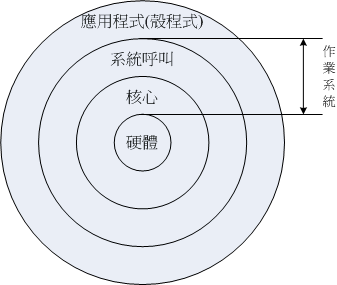

# Linux 歷史

**參考**

* [第一章、Linux是什麼與如何學習](https://linux.vbird.org/linux_basic/centos7/0110whatislinux.php)
* 

### 何謂作業系統

首先，得先知道何謂作業系統：

> 電腦由一堆硬體所組成的，為效率的控制這些硬體資源，就有「作業系統」的產生了。 

作業系統的功能：
* 有效率的控制、分配硬體資源的分配
* 提供電腦運作所需的功能(如網路功能)
* 提供一整組系統呼叫介面來，讓軟體工程師方便開發軟體

作業系統無法跨硬體平台，例如：

> 每種作業系統都有自己的 kernel。 在 2006 年以前的蘋果請 IBM 幫忙開發硬體(所謂的 Power CPU)， 而蘋果電腦公司則在該硬體架構上發展自家的作業系統(俗稱的麥金塔，MAC)。

> Windows 則是開發在 x86 架構上的作業系統，因此 Windows 無法直接在 MAC 上執行。

### Linux 是什麼？

Multics 計畫：想讓主機能有 300 個終端能同時運作。(1964)

* Multics 計畫失敗，但 Ken Thompson 受到啟發。

* Tompson 用組合語言寫出一個小的核心、以及檔案系統。因為簡化了許多 Multics 的功能，所以被戲稱為 Unics。

  > 特色：無論程式、裝置都是檔案。(Everything is a file)

* Unics 大家覺得好用，但是組合語言不好跨機器使用，因此最終改成用高階語言 C 改寫與編譯。這就是 Unix。

  > 為什麼好跨機器：C 語言是高階語言，只要在不同機器稍微改程式碼再編譯就可以了。(組合語言只能重頭寫)

* 以前 Unix 不支援 x86 的個人電腦，不過 1979 就可以了。
  * 兩大分之：System V、BSD

GNU 計畫：

* Richard Stallman 是一個駭客大佬，並加入當時出名的 AI Lab。(1971)

  > AI Lab 風氣是：分享程式碼

* AI Lab 人才流失，只剩下 Richard Stallman

* 原先使用的作業系統為 Lisp，但專利是麻省理工的，無法分享

* Richard Stallman 發現 Unix，雖然也是專利，但架構開放，容易移植到不同機器、也利於分享

* Richard Stallman 開始在 Unix 上開發軟體，並會公布原始碼

* 1984：Richard Stallman 開始 GNU 計畫

  > 目標：開發一套完全自由、開放的 Unix 作業系統

* 寫 OS 很難，Richard Stallman 只一個人 & 沒錢，想寫軟體賺錢

* 出版 Emacs：C 語言 Editor，能檢查程式碼語法錯誤。

* Emacs 賺到錢，Stallman 成立 FSF (Free Software Foundation)，邀請同好一起寫軟體。

* 1990：寫出 GCC (GNU Compiler Collection)、Bash shell

  > GCC：比以前更好的 C 語言編譯器、Bash shell：操作 OS 的介面

* GNU 開始有名，其軟體也跟著有名。
  > 軟體：Emacs、GCC、Bash shell、GNU C Library (glibc)

* 1991：Linus Torvalds 宣稱用 bash、GCC 等 GNU 軟體寫出一個小型的 Unix kernel，能在 x86 上執行。

  > 這個 kernel 就是 Linux。
