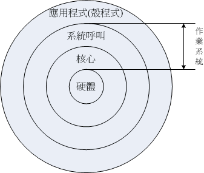

# Linux 歷史

**參考**

* [第一章、Linux是什麼與如何學習](https://linux.vbird.org/linux_basic/centos7/0110whatislinux.php)

### 何謂作業系統

首先，得先知道何謂作業系統：

> 電腦由一堆硬體所組成的，為有效控制這些硬體資源，**方便人類操作電腦**，「作業系統」就產生了。 

作業系統的功能：

* 有效率的控制、分配硬體資源的分配
* 提供電腦運作所需的功能(如網路功能)
* 提供一整組系統呼叫介面，讓軟體工程師方便開發軟體

作業系統無法跨硬體平台，例如：

> 每種作業系統都有自己的 kernel。 在 2006 年以前的蘋果請 IBM 幫忙開發硬體(所謂的 Power CPU)， 而蘋果電腦公司則在該硬體架構上發展自家的作業系統(俗稱的麥金塔，MAC)。

> Windows 則是開發在 x86 架構上的作業系統，因此 Windows 無法直接在 MAC 上執行。

### Linux 是什麼？

> 時間的支線主要分成三段：Unix、GNU 計畫、Linux。簡單來說就是：一個失敗的計畫促成了 Unix、Unix 的商業化導致駭客大佬開啟 GNU 計畫、GNU 計畫的成功最終促成了 Linux 的誕生。

**Unix 的誕生到商業化**

Multics 計畫：此計畫為大名鼎鼎的「貝爾實驗室」創立，想讓主機能有 300 個終端能同時運作。(1964年)

* Multics 計畫失敗，但 [Ken Thompson](https://zh.wikipedia.org/zh-tw/%E8%82%AF%C2%B7%E6%B1%A4%E6%99%AE%E9%80%8A) 受到啟發。

* Tompson 用組合語言寫出一個小的核心、以及檔案系統。因為簡化了許多 Multics 的功能，所以被戲稱為 Unics。

  > 特色：無論程式、裝置都是檔案。(Everything is a file)

* Unics 大家覺得好用，但是組合語言不好跨機器使用，因此最終改成用高階語言 C 改寫與編譯。這就是 Unix，於 1969 發行第一版。

  > 為什麼好跨機器：C 語言是高階語言，只要在不同機器稍微改程式碼再編譯就可以了。(組合語言只能重頭寫)

* 後續 10 年間，Unix 在商業與學術界大大流行，學術界流行的原因是當時 Unix 的擁有者 AT&T 的低價、面費的授權。

* 1979：但後來 AT&T 發現商業價值，因此將 Unix 閉源，不再開放原始碼、分享給學術界。(這間接影響了 1987 年 Andrew S. Tanenbaum 教授開發 Minix)

* 以前 Unix 不支援 x86 的個人電腦，不過 1979 就可以了。
  * 兩大分支：System V、BSD
  
* 1987 年，教授 Andrew S. Tanenbaum 為了教學目的，自行開發了一個「類 Unix」小型作業系統，名為 **Minix**。(後來啟發 Linus Torvalds 開發 Linux)

**GNU 計畫**

* [Richard Stallman](https://zh.wikipedia.org/zh-tw/%E7%90%86%E6%9F%A5%E5%BE%B7%C2%B7%E6%96%AF%E6%89%98%E6%9B%BC) 是一個駭客大佬，並加入當時出名的 AI Lab。(1971年)

  > AI Lab 風氣是：分享程式碼

* AI Lab 原先使用的作業系統為 Lisp，但專利是麻省理工的，無法分享

* Richard Stallman 發現 Unix，雖然也是專利，但架構開放，容易移植到不同機器、也利於分享

* Richard Stallman 開始在 Unix 上開發軟體，並公布原始碼

* 1984：Richard Stallman 開始 GNU 計畫
  
  > 時空背景：Unix 開始商業化、微軟靠賣軟體賺錢
  > 目標：開發一套完全自由、開放的 Unix 作業系統 
  > 自由軟體：自由軟體代表使用者擁有執行、複製、散布、研究、修改、和改善軟體的自由。

* 寫 OS 很難，Richard Stallman 只一個人 & 沒錢，想寫軟體賺錢，來貼補開發費用。

* 1984：Stallman 出版 Emacs：C 語言 Editor，能檢查程式碼語法錯誤。(其實 Emacs 算是以前的舊專案)

* Emacs 賺到錢，Stallman 成立 FSF (Free Software Foundation)，邀請同好一起寫軟體。

* 1990：寫出 GCC (GNU Compiler Collection)、Bash shell

  > GCC：比以前更好的 C 語言編譯器、Bash shell：操作 OS 的介面

* GNU 開始有名，其軟體也跟著有名。
  > 軟體：Emacs、GCC、Bash shell、GNU C Library (glibc)

**GNU 與大學生**

> 時空背景：大學生 Linux Torvalds 用了上面介紹過的 Minix，雖然好用，但原作者 Andrew 教授並不開放其他人添加功能(程式碼只讓大家「看與用」)。

* 1991：Linus Torvalds 宣稱用 bash、GCC 等 GNU 軟體寫出一個小型的 Unix kernel，能在 x86 上執行。這個 kernel 就是 Linux。

Linux 與 GNU 的關係：

* GNU 計畫原本缺乏核心程式（Kernel），導致只能在其他 Unix 系統上運行。Linux 的出現補足了這一塊，使 GNU 軟體能在自由核心上運作。因此，Stallman 主張應稱作 GNU/Linux，強調 GNU 的貢獻(因為 Linux 也使用了很多 GNU 軟體)。

Linux 的發展與應用：

* Linux 本身僅提供核心與基本工具，但因相容性佳，許多自由軟體（如 postfix、Apache）都選擇以其為開發平台。

* 隨著軟體陣容日益完整，使用 Linux 打造一個完整作業系統成為可能。

Linux Distribution（發行版）的誕生：

* Linux 初期使用門檻高，因為主要由駭客與技術工程師維護，不利於一般使用者。

* 為解決這問題，許多公司或團體整合 Linux 核心、應用軟體與安裝工具，製作成可安裝使用的套件（Distribution）。

* 這些發行版讓使用者可以透過光碟、DVD 或網路輕鬆安裝與管理 Linux 系統。

> 簡而言之：Linux 核心補足了 GNU 計畫的不足，促成完整自由作業系統的誕生；透過發行版，Linux 也逐漸走向大眾化。
> 發行版的例子：Red Hat、Debian 等等。