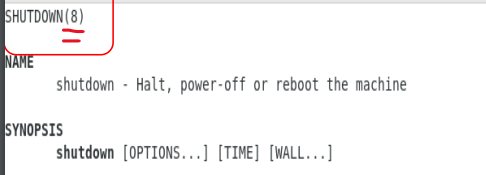

# 02 Linux 初探

* [終端介面](#終端介面)
* [Linux 命令行](#linux-命令行)
* [Linux 指令](#linux-指令)
* [熱鍵](#熱鍵)
* [特殊符號](#特殊符號)
* [忘記指令怎麼辦？](#忘記指令怎麼辦)

### 終端介面

* **ctrl + alt + f2 ~ f6**：切換終端機

### Linux 命令行

Linux 「命令行」由以下兩者組成：

```bash
sysop@hostname:~$ ls -al
```

* 提示字元 (Shell prompt)：通常是 `$` 或 `#`。
  * 一般使用者：`$`
  * 管理員：`#`

  > Shell prompt 作用：分辨身分、提使使用者可輸入指令。

* 指令本身：`ls`、`pwd`

### Linux 指令

指令由三者組成，用「空格」分開：

* command
* options
* arguments

```bash
<command> -<options> <arguments1> <arguments2> ...
```

* **command**：指令名稱，ls、pwd、cd。
* **options**：選項，用「-」或「--」開頭，例如 `-a`、`--all`。
* **arguments**：參數，指令的對象，例如 `/opt`。

> 揍人：揍，要大力揍？小力揍？揍誰？

**測試：分辨 command、options、arguments**

```bash
echo 1
echo -n 1
echo "1\n2\n3"
echo -e "1\n2\n3"
```

```bash
ls /opt
ls -a /opt
ls -l /opt
ls -a -l /opt
ls -al /opt
ls --all /opt
ls -all /opt
ls -- -all /opt
```

### 熱鍵

* **Tab**：自動補齊檔案 or 指令(bash shell)
* **Ctrl + c**：中斷目前執行的指令
* **Ctrl + d**：結束 shell
* **Ctrl + l**：清除畫面
* **Ctrl + a**：游標移到行首
* **Ctrl + e**：游標移到行尾
* **Ctrl + u**：刪除游標前的字元
* **Ctrl + k**：刪除游標後的字元
* **Ctrl + r**：搜尋歷史指令
* **Alt + .**：重複上一個指令的最後一個 argument (建議多試幾次來理解)
* **page up / page down**：上下翻之前執行的指令

### 特殊符號

* **~**：家目錄
* **.**：目前目錄
* **..**：上一層目錄
* **/**：根目錄
* **-**：前一個工作目錄, 例如：
```bash
cd /etc
cd ~
cd -
```

### 忘記指令怎麼辦？

**man**

```bash
man ls
```

| 操作 | 說明 |
| --- | --- |
| **空白鍵** | 下一頁 |
| **page down** | 下一頁 |
| **page up** | 上一頁 |
| **/keyword** | 搜尋關鍵字 |
| **n** | 繼續往下搜尋關鍵字 |
| **N** | 往上搜尋關鍵字 |
| **q** | 離開 |

> man 的 1, 5, 8

```bash 
man shutdown
```


* 1：一般使用者可以使用的指令
* 5：設定檔與檔案格式
* 8：系統管理員可以使用的指令：

ex: `man 1 ls`、`man 5 passwd`、`man 8 useradd`

**-h、--help**

```bash
ls -h
ls --help
```