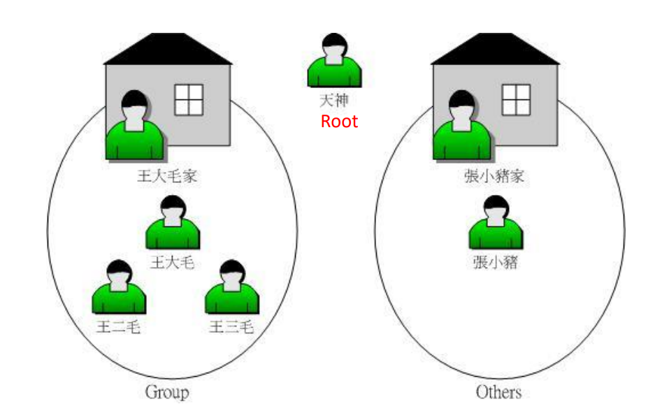
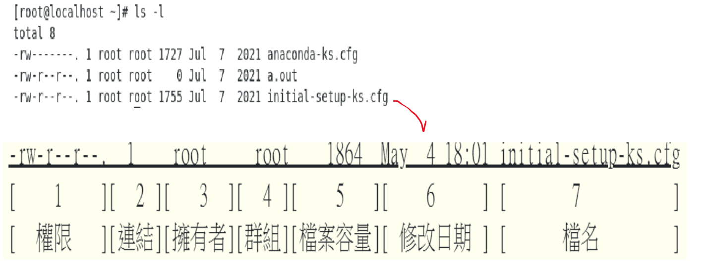
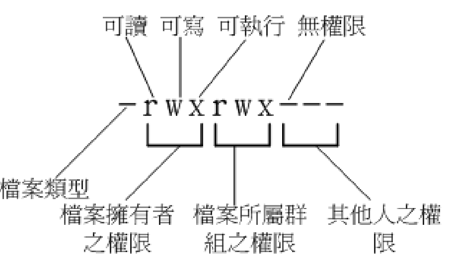
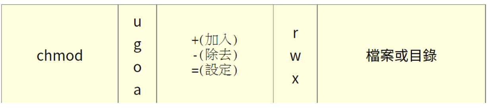
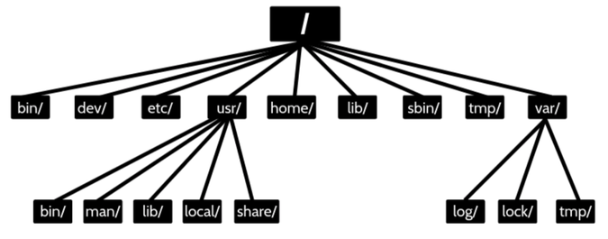

# 檔案權限 & 目錄配置


* [前情提要：切換成 root](#前情提要切換成-root)

* [檔案的 擁有者/群組/其他人](#檔案的-擁有者群組其他人)

* [Linux 使用者身份與群組記錄的檔案](#linux-使用者身份與群組記錄的檔案)

* [觀察檔案權限](#觀察檔案權限)

* [權限修改](#權限修改)
  * [chgrp：改變檔案所屬群組](#chgrp改變檔案所屬群組)
  * [chown：改變檔案擁有者](#chown改變檔案擁有者)
  * [chmod：改變檔案權限](#chmod改變檔案權限)

* [目錄與檔案之權限意義 (重要)](#目錄與檔案之權限意義-重要)

* [Linux檔案種類](#linux檔案種類)

* [目路樹](#目路樹)

* [路徑](#路徑)
  * [絕對路徑 vs 相對路徑](#路徑種類絕對路徑-vs-相對路徑)

## 前情提要：切換成 root

```bash
sudo -i
```

or

```bash
su -
```

or


sudo 和 su 這兩個命令之間的最大區別在於：

* 密碼使用：

  * sudo 需要輸入當前使用者的密碼。
  * su 需要輸入 root 使用者的密碼。

* 預設行為：

  * sudo 只允許以提升權限運行單個命令。ex: sudo cat /etc/shadow
  * su 則會啟動一個新的 shell，並允許持續以 root 權限運行多個命令，直到手動退出。

> 其他差別，可參考[這裡](https://www.cnblogs.com/paul8339/p/9724738.html)

## 檔案的 擁有者/群組/其他人

所有檔案都具有『User, Group 及 Others』三種身份的個別權限：

* **擁有者(owner)**:檔案擁有者
* **群組(group)**:檔案所屬的群組,群組由多個使用者組成
* **其他人(others)**:不屬於上述兩者

> 使用者分群組，有什麼用？

A：Linux是個多人多工的系統,必須保護每個使用者的隱私，群組可想像為一家人，家庭就是群組，而家庭成員即是使用者，但家庭成員應互相尊重隱私，也會彼此分享資源

> 其他人的概念？不是擁有者也不是同群組，就是其他人



## Linux 使用者身份與群組記錄的檔案

* 有哪些使用者：/etc/passwd
* 有哪些群組：/etc/group
* 密碼：/etc/shadow

> 詳細設定後面章節會再講

## 觀察檔案權限

先來看看 ls –l 的結果：

```bash
ls -l
```




上圖中有的欄位[1] [2] … 就是下面講解的順序 !

---

**[1]權限**：



* 第一個字元代表檔案類型：
  * d：目錄
  * -：檔案
  * l：連結檔
  * s：socket 檔，用於網路上的資料承接，例如啟動 socket 監聽需求
  * b：裝置檔(可隨機存取裝置，ex：硬碟)
  * c：裝置檔(序列埠裝置，ex: 鍵盤、滑鼠)

* 查看裝置檔：

```bash
ls /dev/<tab>
```

* rwx 的意義：
    * r：讀取權限
    * w：寫入權限
    * x：執行權限

> Q：從下方資訊能解讀出，今天有一個使用者叫做小明，小明是群組 A 的成員，有一個 test.txt 的擁有者為小明，檔案的所屬群組為 A ，且該檔案的權限如下：rwx r-- r-- , 那小明對該檔案是屬於 rwx 權限還是 r - - 權限呢 ?

```text
-rwxr--r-- 1 小明 A 0 2021-07-01 00:00 test.txt
```

A：權限的身分比對是由左往右 , 若身分符合就不再繼續比對 ; 因此小明的身分比對會停在使用者權限 , 不會繼續往右比對 , 所以小明對該檔案的權限為 rwx。

注意：Linux 的副檔名和 windows 不同，Linux 的副檔名是沒有意義的，只是為了方便使用者辨識。

> 舉例來說，在 Windows 中，`.txt` 會讓一個檔案變成文字檔。但在 Linux 中，`.txt` 只是讓使用者「知道」這是文字檔而已。

***

**[2]連結數量**：

每個檔案都會將他的權限與屬性記錄到檔案系統的 i-node 中，因此每個檔名就會連結到一個 i-node。

> 什麼是 i-node？簡單講就是在檔案系統中，有一個「號碼」紀錄檔案的權限、屬性等等，而這個號碼就是 i-node。

第二欄記錄的，就是有多少不同的檔名連結到「相同的一個i-node號碼」。

> 會出現「多個檔名連結到同個 i-node」的情況，很長是因為「連結檔」(link file) ，類似於 Windows 的「捷徑」。

範例 1：

```bash
touch test.txt # 建立 test.txt
ls -l test.txt # 先觀察 test.txt 的連結數量 
ln test.txt test2.txt # 幫 test.txt 建立一個連結檔，名為 test2.txt
ls -l test.txt # 再次觀察 test.txt 的連結數量
```
> 有兩個檔名連到同一個 i-node (test.txt 和 test2.txt)，所以連結數量是 2。

範例 2：

我們知道「.」代表的是當前目錄，而這個 . 其實就是該目錄的連結檔，所以每個目錄至少會有一個連結檔指向自己。(也就是說，目錄一定會至少存在 2 個連結數量)：

```bash
mkdir test # 建立一個 test 目錄
ls -ld test # 觀察 test 目錄的連結數量
ls -a test # 觀察 test 目錄內容
```
> 你看，新的目錄 test 的連結數量是 2，因為在 ls -a test 的結果中，「.」就是新目錄 test 的連結檔。(有兩個檔名連到同一個 i-node，分別是 test 和 .，所以連結數量是 2)。

然後「..」代表的是上一層目錄，所以當一個目錄下有 n 個子目錄時，該目錄的連結數量就會是 n+2。

```bash
mkdir test/test2 # 建立第一個子目錄 test2 
mkdir test/test3 # 建立第二個子目錄 test3
ls -ld test # 觀察 test 目錄的連結數量
```
> 你可以自己用 ls -a 觀察 test/test2 和 test/test3 的內容，會發現兩者都存在「..」這個檔案，而 .. 就是上層目錄，也就是 test 的連結檔，因此現在 test 目錄的連結數量是 4。

---

**[3]擁有者帳號**

***

**[4]所屬群組**

---

**[5]檔案大小**：預設單位為 byte

```bash
ls -lh /etc
```
> 讓人更容易理解大小

***

**[6]建立時間 or 最近修改時間**

---

**[7]檔名**

若檔名用「.」開頭，代表隱藏檔。

***

## 權限修改

### chgrp：改變檔案所屬群組

語法：

```bash
chgrp [-R] <group-name> <file/dir>
```
* -R：遞迴變更，即連同次目錄底下所有檔案、目錄都更新群組

**範例**

```bash
chgrp users initial-setupks.cfg
```


### chown：改變檔案擁有者

**語法**：

```bash
chown [-R] 帳號名稱 檔案或目錄
chown [-R] 帳號名稱:群組名稱 檔案或目錄
```

| Option | 說明 |
|-------|------|
| -R | 遞迴變更，即連同次目錄底下所有檔案、目錄都更新擁有者 |

**範例**：將 initial-setup-ks.cfg 的擁有者改為 bin 這個帳號：

```bash
chown bin initial-setup-ks.cfg
```
```bash
ls -l initial-setup-ks.cfg
```
```text
-rw-r--r--. 1 bin users 1864 May  4 18:01 initial-setup-ks.cfg
```

> 事實上，chown也可以使用『chown user.group file』來**同時**修改 user 和 group，(在擁有者與群組間加上小數點『 . 』，不過建議使用冒號『:』來隔開擁有者與群組，因為怕有.開頭的 user 或 group)：

```bash
touch test.txt
chown sysop:sysop test.txt # 把 test.txt 的擁有者改成 sysop，群組也改成 sysop
```

這招也能單純的修改所屬群組！例如『chown :sshd initial-setupks.cfg』就是只修改群組。

### chmod：改變檔案權限

兩種設定方式：

**數字法：r=4, w=2, x=1**

權限對應的分數：

> 為何是 4,2,1？因為權限對應到的分數轉成二進位後，數字 1 就是 `rwx` 他們各自所在的位置！

```text
100 010 001
r-- -w- --x
```

r: 4（二進位為 100）  
w: 2（二進位為 010）  
x: 1（二進位為 001）  

**語法**：

```bash
chmod [-R] <xyz> <file/dir>
```

| Option | 說明 |
|-------|------|
| -R | 遞迴變更，即連同次目錄底下所有檔案、目錄都更新擁有者 |

| Arg | 說明 |
|-----|------|
| xyz | 權限數字，xyz 代表 owner/group/others 的權限 |

> **範例**：修改 .bashrc 的權限為所有人皆有 rwx 權限

```bash
ls -al .bashrc
```
```text
-rw-r--r--. 1 root root 176 Dec 29 2013 .bashrc
```

```bash
chmod 777 .bashrc
ls -al .bashrc
```
```text
-rwxrwxrwx. 1 root root 176 Dec 29 2013 .bashrc
```

測試後要記得改回來：

```bash
 chmod 644 .bashrc 
```

> **範例**：熟悉數字法的加總方式與效果 (777 vs 440)

```bash
touch chmod.txt
chmod 777 chmod.txt
ll chmod.txt
chmod 440 chmod.txt
ll chmod.txt
```

數字法其實很單純，就想好 owner/group/others 的權限要給多少，然後個別把分書加總即可。

看完修改權限的數字法後，接下來介紹「符號法。

**符號法**



* +,- 沒有指定權限的不變

* = 沒有指定的權限會消失


> **範例**：設定一個檔案的權限成為「-rwxr-xr-x」

```bash
touch chmod.txt
chmod a=rwx,go=rx chmod.txt
```

> **範例**：不知原先的檔案屬性，只想要增加每個人均可寫入的權限

```bash
chmod a+w chmod.txt
```

> **範例**：將權限去掉而不更動其他已存在的權限呢？例如要拿掉全部人的可執行權限

```bash
chmod a-x chmod.txt
```

## 目錄與檔案之權限意義 (！重要！)

**檔案：**

實際含有資料的地方，包括一般文字檔、資料庫內容檔、二進位可執行檔(binary program)等等。

權限對於檔案來說，意義是這樣的：

* r (read)：可讀取此一檔案的實際內容，如讀取文字檔的文字內容等。
* w (write)：可以編輯、新增或者是修改該檔案的內容(**但不含刪除該檔案、改檔名**)
* x (execute)：該檔案具有可以被系統執行的權限。

> 對於檔案的rwx來說， 主要都是針對『檔案的內容』，與檔案檔名的存在與否**沒有關係**。


**目錄：**

主要的內容在記錄**檔名清單**

權限對目錄的代表意義：

* r (read contents in directory)：

  * 表示具有讀取目錄結構清單的權限

  * 當你具有讀取(r)目錄的權限時，可以查詢該目錄下的檔名資料。(可以 ls)

  * **注意** : 具有 r 權限能用 ls 看到檔名清單，但不一定能用 ls –l 看到檔案權限，能否看到檔按權限是由下面介紹的x權限來決定。

* w (modify contents of directory)：

  * w 權限對目錄來說，表示具有「改動該目錄結構清單」的權限，也就是底下這些權限：
    * 建立新的檔案與目錄。
    * 刪除已經存在的檔案與目錄(不論該檔案的權限為何！)
    * 將已存在的檔案或目錄進行更名。
    * 搬移該目錄內的檔案、目錄位置。
  
  > 總之，目錄的w權限就與該目錄底下的檔名異動有關

* x (access directory)：

  * 目錄的 x 代表「能否進入該目錄成為工作目錄」。

  * 所謂的工作目錄(work directory)就是你目前所在的目錄。舉例來說，當你登入 Linux 時，你所在的家目錄就是你當下的工作目錄。而變換目錄的指令是『cd』(change directory)。

  * 沒有x的話用 ls –l 看不到權限(假設只有r的情況下)

  * 要開放目錄給任何人瀏覽時，應該至少也要給予r(可看到檔名列表,但看不到權限)及x(進入此目
錄)的權限，但w權限不可隨便給(這樣別人就可以隨意刪除檔案)！


**表格整理**

| 元件 | 內容         | 疊代物件     | r（讀取）         | w（寫入）         | x（執行）               |
|------|--------------|--------------|-------------------|-------------------|--------------------------|
| 檔案 | 詳細資料data | 文件資料夾   | 讀到文件內容       | 修改文件內容       | 執行文件內容             |
| 目錄 | 檔名         | 可分類抽屜   | 讀到檔名           | 修改檔名           | 進入該目錄的權限(key)    |


**例題**

假設有個帳號名稱為 `dmtsai`，他的家目錄在 `/home/dmtsai/`，`dmtsai` 對此目錄具有 `[rwx]` 的權限。  
若在此目錄下有個名為 `the_root.data` 的檔案，該檔案的權限如下：

```text
-rwx------ 1 root root 4365 Sep 19 23:20 the_root.data
```

請問 `dmtsai` 對此檔案的權限為何？可否刪除此檔案？

**答案**

如上所示，由於 `dmtsai` 對此檔案來說是「others」的身份，  
因此這個檔案他：

- 無法讀（read）
- 無法寫（write）
- 無法執行（execute）

也就是說，他**無法變動這個檔案的內容**。

但由於這個檔案**位於他的家目錄下**，而 `dmtsai` 對此目錄具有 `[rwx]` 的完整權限，  
因此對於 `the_root.data` 這個「檔名」來說，**他是能夠刪除的**！


**結論**：

`dmtsai` 這個用戶**可以刪除** `the_root.data` 這個檔案！

---

**常見操作的最少所需權限**

| 操作動作           | /dir1 | /dir1/file1 | /dir2 | 重點 |
|--------------------|-------|-------------|-------|------|
| 讀取 file1 內容   | x     | r           | -     | 要能夠進入 /dir1 才能讀到裡面的文件資料！ |
| 修改 file1 內容   | x     | rw          | -     | 能夠進入 /dir1 且修改 file1 才行！ |
| 執行 file1 內容   | x     | rx          | -     | 能夠進入 /dir1 且 file1 能運作才行！ |
| 刪除 file1 檔案   | wx    | -           | -     | 能夠進入 /dir1 具有目錄修改的權限即可！ |
| 將 file1 複製到 /dir2 | x  | r           | wx    | 要能夠讀 file1 且能夠修改 /dir2 內的資料 |


> 用「抽屜」的方式理解：

* 目錄的 r：能看到抽屜裏面有什麼東西
* 目錄的 w：能隨意的拿走或放進抽屜裏面
* 目錄的 x：手能伸進抽屜裏面

一個檔案一定屬於某個目錄(抽屜)，當你要對這個檔案做任何事情前，至少手要能伸到抽屜(目錄的x)！而刪除、建立檔案則會動到目錄的清單結構，因此與目錄的w有關。

至於檔案的權限就比較直觀了：

* 檔案的 r：閱讀檔案
* 檔案的 w：編輯檔案
* 檔案的 x：執行檔案

當你要執行一個檔案時，至少得先有該檔案所屬目錄的 x，並知道要執行什麼內容(檔案的r)，最後還要有執行的權限(檔案的x)，否則你也只能閱讀檔案而已。

## Linux檔案種類

> Everything is file, file is everything

也就是說，不論是文字檔、目錄、硬碟、滑鼠、鍵盤 …對 Linux 來說都是檔案。

既然所有東西都是檔案，那所有東西都有各自屬性與權限，也都可以透過檔案系統管理(後面會講)。

## 目路樹



### 根目錄 (/) 的意義與內容：

根目錄是整個系統最重要的一個目錄，不但所有的目錄都由根目錄衍生，同時根目錄也與開機/還原/系統修復等動作有關。

由於系統開機時需要特定的開機軟體、核心檔案、開機所需程式、函式庫等等檔案資料，若系統出現錯誤時，根目錄也必須要包含有能夠修復檔案系統的程式才行。

因為根目錄是這麼的重要，所以在 FHS(Filesystem Hierarchy Standard) 的要求方面，希望根目錄根目錄(/)所在分割槽應該越小越好， 且應用程式所安裝的軟體最好不要與根目錄放在同一個分割槽內，保持根目錄越小越好。 如此不但效能較佳，根目錄所在的檔案系統也較不容易發生問題。


FHS 定義 / 底下要有這些目錄：

| 目錄 | 說明 |
| --- | --- |
| /bin | 一般使用者、root 都可用的指令，在單人維護模式下仍可使用 |
| /boot | 開機所需的檔案 |
| /dev | 裝置檔案 |
| /etc | 系統設定檔 |
| /lib | 開機或指令會用到的函式庫 |
| /media | 可移除媒體裝置的掛載點(ex: DVD、光碟) |
| /mnt | 暫時掛載其他裝置 |
| /opt | 第三方軟體安裝目錄 |
| /run | 放置開機後產生的資訊 |
| /sbin | root 使用的指令 |
| /srv | 服務檔案 |
| /tmp | 暫存檔案 |
| /usr | 後續介紹 |
| /var | 後續介紹 |
| /home | 使用者預設家目錄 |
| /root | root 的家目錄 |
| /proc | 存放系統資訊在記憶體中 |
| /sys | 類似 /proc |

/usr 底下的重要目錄：

| 目錄 | 說明 |
| --- | --- |
| /usr/bin | 一般使用者可用的指令，/bin 其實是 /usr/bin 的連結檔 |
| /usr/lib | /lib 的連結檔 |
| /usr/local | 系統管理員下載的軟體 |
| /usr/sbin | 非系統正常運作所需的指令，為 /sbin 的連結檔 |
| /usr/share | 主要放唯讀資料、共享文件 (例如 /usr/share/man) |


/var 底下的重要目錄：

| 目錄 | 說明 |
| --- | --- |
| /var/cache | 應用程式運作產生的暫存檔 |
| /var/lib | 程式執行本身需要用到的資料 |
| /var/lock | 目前挪到 /run/lock，放置只能一次被一個程式使用的檔案 |
| /var/log | 很重要的檔案，放置登錄檔 |
| /var/mail | 放置使用者郵件，目前挪到 /var/spool/mail |
| /var/run | 連結到 /run |
| /var/spool | 放置佇列資料(排隊等其他程式處理) |


## 路徑

前情提要：工作目錄
* 能用 pwd 查看

### 路徑種類：絕對路徑 vs 相對路徑

* 絕對路徑：從根目錄開始的路徑，例如 `/etc/passwd`。

* 相對路徑：從目前工作目錄開始的路徑，例如在 `/tmp` 中，想表示上層根目錄下的 /etc/passwd，可以 `../etc/passwd`。**總之不是從 / 開始的路徑都叫相對路徑**。

> 相對路徑常用符號：

* `~`：家目錄, ex: `~/Desktop`

* `.`：目前目錄, ex: ./test.txt

* `..`：上一層目錄, ex: ../test.txt

