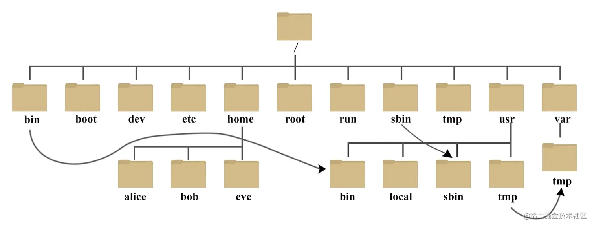

# 檔案權限 & 目錄配置

## 前情提要：切換成 root

```bash
sudo -i
```

or

```bash
su -
```

sudo 和 su 這兩個命令之間的最大區別在於：

* 密碼使用：

  * sudo 需要輸入當前使用者的密碼。
  * su 需要輸入 root 使用者的密碼。

* 預設行為：

  * sudo 只允許以提升權限運行單個命令。ex: sudo cat /etc/shadow
  * su 則會啟動一個新的 shell，並允許持續以 root 權限運行多個命令，直到手動退出。

> 其他差別，可參考[這裡](https://www.cnblogs.com/paul8339/p/9724738.html)

### 檔案的 擁有者/群組/其他人

所有檔案都具有『User, Group 及 Others』三種身份的個別權限：

* **擁有者(owner)**:檔案擁有者
* **群組(group)**:檔案所屬的群組,群組由多個使用者組成
* **其他人(others)**:不屬於上述兩者

> 使用者分群組，有什麼用？

A：Linux是個多人多工的系統,必須保護每個使用者的隱私，群組可想像為一家人,家庭就是群組,而家庭成員即是使用者,但家庭成員應互相尊重隱私,也會彼此分享資源

> 其他人的概念？


### Linux 使用者身份與群組記錄的檔案

* 有哪些使用者：/etc/passwd
* 有哪些群組：/etc/group
* 密碼：/etc/shadow

> 詳細設定後面會再講

### 觀察檔案權限

先來看看 ls –l 的結果：

```bash
ls -l
```


> 上圖中有的欄位[1] [2] … 就是下面講解的順序 !

### [1]權限：


* **第一個字元代表檔案類型**：
  * d：目錄
  * -：檔案
  * l：連結檔
  * s：socket 檔，用於網路上的資料承接，例如啟動 socket 監聽需求
  * b：裝置檔(可隨機存取裝置，ex：硬碟)
  * c：裝置檔(序列埠裝置，ex: 鍵盤、滑鼠)

```bash
ls /dev/<tab>
```

* **rwx**：
    * r：讀取權限
    * w：寫入權限
    * x：執行權限

> Q：今天有一個使用者叫做小明 , 小明是群組 A 的成員 ; 現在有一個 test.txt 的擁有者為小明 , 檔案的所屬群組為 A , 且該檔案的權限如下 : r w x r - - r - - , 那小明對該檔案是屬於 rwx 權限還是 r - - 權限呢 ?

```text
-rwxr--r-- 1 小明 A 0 2021-07-01 00:00 test.txt
```

A：權限的身分比對是由左往右 , 若身分符合就不再繼續比對 ; 因此小明的身分比對會停在使用者權限 , 不會繼續往右比對 , 所以小明對該檔案的權限為 rwx。

注意：Linux 的副檔名和 windows 不同，Linux 的副檔名是沒有意義的，只是為了方便使用者辨識。

### [2]連結數量：

每個檔案都會將他的權限與屬性記錄到檔案系統的 i-node 中 , 因此每
個檔名就會連結到一個 i-node。

第二欄記錄的，就是有多少不同的檔名連結到**相同的一個i-node號碼**。

```bash
touch test.txt
ls -l test.txt
ln test.txt test2.txt
ls -l test.txt
```

```bash
ls -al /tmp
ls -ld /tmp
mkdir /tmp/test
ls -al /tmp/test
ls -ld /tmp
```

### [3]擁有者帳號

### [4]所屬群組

### [5]檔案大小，預設單位為 byte

```bash
ls -lh /etc
```
> 讓人更容易理解大小

### [6]建立時間 or 最近修改時間

### [7]檔名

若檔名用「.」開頭，代表隱藏檔。

> 特殊符號的意義還記得嗎？ 提示：. 與 .. 都是隱藏檔，但意義不同。

### 權限的修改

**chgrp**：改變檔案所屬群組


> SUID、SGID、SBIT 是什麼後面會再講

**chown**：改變檔案擁有者


> 事實上，chown也可以使用『chown user.group file』來一次修改 user 和 group，(在擁有者與群組間加上小數點『 . 』，不過建議使用冒號『:』來隔開擁有者與群組 (怕有.開頭的user或group)：

```bash
touch test.txt
chown sysop:sysop test.txt
```

這招也能單純的修改所屬群組！例如『chown :sshd initial-setupks.cfg』就是修改群組

**chmod**：改變檔案權限

兩種設定方式：

* **數字法：r=4, w=2, x=1**




```bash
touch chmod.txt
chmod 777 chmod.txt
ll chmod.txt
chmod 440 chmod.txt
ll chmod.txt
```

* **符號法**


* +,- 沒有指定權限的不變

* = 沒有指定的權限會消失

**注意**

> 範例：設定一個檔案的權限成為『-rwxr-xr-x』

```bash
touch chmod.txt
chmod a=rwx,go=rx chmod.txt
```

> 範例：不知原先的檔案屬性，只想要增加每個人均可寫入的權限

```bash
chmod a+w chmod.txt
```

> 範例：將權限去掉而不更動其他已存在的權限呢？例如要拿掉全部人的可執行權限

```bash
chmod a-x chmod.txt
```

### 目錄與檔案之權限意義

**檔案：**

實際含有資料的地方，包括一般文字檔、資料庫內容檔、二進位可執行檔(binary program)等等。

權限對於檔案來說，意義是這樣的：

* r (read)：可讀取此一檔案的實際內容，如讀取文字檔的文字內容等。
* w (write)：可以編輯、新增或者是修改該檔案的內容(**但不含刪除該檔案、改檔名**)
* x (execute)：該檔案具有可以被系統執行的權限。

> 對於檔案的rwx來說， 主要都是針對『檔案的內容』，與檔案檔名的存在與否**沒有關係**。


**目錄：**

主要的內容在記錄**檔名清單**

權限對目錄的代表意義：

* r (read contents in directory)：

  * 表示具有讀取目錄結構清單的權限

  * 當你具有讀取(r)目錄的權限時，可以查詢該目錄下的檔名資料。(可以 ls)

  * 至少需要對該檔案具有 r 權限，才能複製該檔案。

  * **注意** : 具有 r 權限能用 ls 看到檔名清單，但不一定能用 ls –l 看到檔案權限，能否看到檔按權限是由下面介紹的x權限來決定。

* w (modify contents of directory)：

  * w 權限對目錄來說，表示具有「改動該目錄結構清單」的權限，也就是底下這些權限：
    * 建立新的檔案與目錄。
    * 刪除已經存在的檔案與目錄(不論該檔案的權限為何！)
    * 將已存在的檔案或目錄進行更名。
    * 搬移該目錄內的檔案、目錄位置。
  
  > 總之，目錄的w權限就與該目錄底下的檔名異動有關

* x (access directory)：

  * 目錄的 x 代表「能否進入該目錄成為工作目錄」。

  * 所謂的工作目錄(work directory)就是你目前所在的目錄。舉例來說，當你登入 Linux 時，你所在的家目錄就是你當下的工作目錄。而變換目錄的指令是『cd』(change directory)。

  * 沒有x的話用 ls –l 看不到權限(假設只有r的情況下)

  * 要開放目錄給任何人瀏覽時，應該至少也要給予r(可看到檔名列表,但看不到權限)及x(進入此目
錄)的權限，但w權限不可隨便給(這樣別人就可以隨意刪除檔案)！


  **圖示整理**

  


### Linux檔案種類

> Everything is file, file is everything

也就是說，不論是文字檔、目錄、硬碟、滑鼠、鍵盤 …對 Linux 來說都是檔案。

既然所有東西都是檔案，那所有東西都有各自屬性與權限，也都可以透過檔案系統管理(後面會講)。

### 目路樹


常見的：


### 路徑

前情提要：工作目錄
* 能用 pwd 查看

路徑種類：


