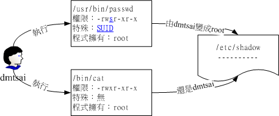

# Linux 檔案與目錄管理

* 目錄 & 路徑
  * [相對路徑 & 絕對路徑](#相對路徑--絕對路徑)
  * [執行檔路徑的變數：$PATH](#執行檔路徑的變數path)
  * [查看 PATH & 添加路徑到 PATH](#查看添加路徑)
  * [目錄的特殊符號](#目錄的特殊符號)
  * [切換目錄 --- cd](#切換目錄-----cd)
  * [顯示當前的工作目錄 --- pwd](#顯示當前的工作目錄-----pwd)
  * [建立新目錄 --- mkdir](#建立新目錄-----mkdir)
  * [刪除「空的」目錄 --- rmdir](#刪除空的目錄-----rmdir)

* 檔案與目錄管理
  * [檢視檔案與目錄 --- ls](#檢視檔案與目錄-----ls)
  * [複製檔案與目錄 --- cp](#複製檔案與目錄-----cp)
    * [cp 的常用選項整理](#cp-的常用選項整理)
  * [移除檔案與目錄 --- rm](#移除檔案與目錄-----rm)
  * [移動檔案與目錄，或更名 --- mv](#移動檔案與目錄或更名-----mv)
  * [取得路徑的檔案名稱與目錄名稱 --- basename, dirname](#取得路徑的檔案名稱與目錄名稱-----basename-dirname)

* 檔案內容查閱
  * [直接檢視檔案內容 --- cat](#直接檢視檔案內容-----cat)
  * [反向顯示檔案內容 --- tac](#反向顯示檔案內容-----tac)
  * [顯示行號 --- nl](#顯示行號-----nl)
  * [可翻頁檢視 --- more & less](#可翻頁檢視-----more--less)
  * [資料擷取](#資料擷取-----head--tail)
    * [head & tail 的搭配使用](#head--tail-的搭配使用)
  * [讀取非純文字檔案 --- od](#讀取非純文字檔-----od)

* [修改檔案時間或建立新檔 --- touch](#修改檔案時間或建立新檔案-----touch)

* 預設權限 & 隱藏權限
  * [預設權限 --- umask](#預設權限-----umask)
    * [修改並利用 umask](#修改並利用-umask)
    * [常見錯誤：直接用減法來想 umask](#常見錯誤直接用減法來想-umask)
  * [隱藏權限：SUID, SGID, SBIT](#隱藏權限suid-sgid-sbit)
    * [設定 SUID, SGID, SBIT](#設定-suid-sgid-sbit)
    * [觀察檔案類型 --- file](#觀察檔案類型-----file)

* [設定與觀察檔案的隱藏屬性 --- chattr & lsattr](#設定與觀察檔案的隱藏屬性-----chattr--lsattr)

* 檔名的搜尋
  * [在某些特定的目錄中找尋檔案 --- whereis](#在某些特定的目錄中找尋檔案-----whereis)
  * [去「檔名資料庫」中找尋檔案 --- locate & updatedb](#去檔名資料庫中找尋檔案-----locate--updatedb)
  * [強大的檔案搜尋工具 --- find](#強大的檔案搜尋工具-----find)

* [極重要的複習：要執行某項指令或操作，至少需要什麼權限？](#極重要的複習要執行某項指令或操作至少需要什麼權限)

## 目錄 & 路徑

### 相對路徑 & 絕對路徑

* **絕對路徑**：「由根目錄 / 寫起」，例如： /usr/share/doc。
  * 優點：最精確的定位，除非打錯字不然不會出錯。
  * 缺點：輸入的字串較長，如果目錄名稱很長，輸入會很麻煩。

  > 善用 bash shell 的 Tab 鍵，可以自動補齊路徑名稱！！


* **相對路徑**：「不是由 / 寫起」，意指『相對於目前工作目錄的路徑！』。例如從 /usr/share/doc 要到 /usr/share/man 底下時，可以寫成： 『cd ../man』這就是相對路徑。
  * 優點：較方便使用，且比較彈性。
  * 缺點：使用前提是你要非常清楚目錄結構，否則容易出錯。

### 執行檔路徑的變數：$PATH

前一章的說明中，我們知到 ls 指令的完整檔名為：/bin/ls (絕對路徑)， 那你會不會覺得很奇怪：
> 為什麼我可以在任何地方執行/bin/ls這個指令呢？

照理來說，如果你當前的工作目錄**不在** /bin，那只輸入「ls」是一種相對路徑表示法，應該會找不到該指令才對！但是，為什麼我們可以在任何地方執行 ls 呢？這就是因為環境變數「PATH」的幫助。

PATH(一定是大寫)這個變數的內容是由一堆目錄所組成：

* 每個目錄中間用冒號(:)來隔開
* 有順序之分

在執行一個指令的時候，舉「ls」為例，系統會依照 PATH 的設定，去每個 PATH 「定義的目錄」下搜尋檔名為「ls」的可執行檔，如果在PATH定義的目錄中含有多個檔名為 ls 的可執行檔，那麼**先搜尋到的同名指令先被執行**。

現在，請下達「echo \$PATH」來看看到底有哪些目錄被定義出來了？ echo有「顯示、印出」的意思，而 PATH 前面加的 $ 表示後面接的是變數，所以會顯示出目前的 PATH：


> **範例**：用 root 的身分搜尋到的 PATH 為何？
```bash
echo $PATH
```
```text
/usr/local/sbin:/usr/local/bin:/sbin:/bin:/usr/sbin:/usr/bin:/root/bin
```

> **範例**：用一般使用者的身分搜尋到的 PATH 為何？
```bash
# 登出 root
exit
```

```bash
echo $PATH
```
```text
/usr/local/bin:/usr/bin:/usr/local/sbin:/usr/sbin:/home/dmtsai/.local/bin:/home/dmtsai/bin
```

> 上一章節提過，由於 /bin 的連結檔是 /usr/bin，所以普通使用者與 root 都能使用到 ls 指令。

**例題**

假設你是root，如果你將 ls 從 /bin/ls 移動到 /root/ls (可用『mv /bin/ls /root』指令達成)，然後你自己本身也在/root目錄下， 請問：

(1)你能不能直接輸入 ls 來執行？

(2)若不能，你該如何執行 ls 這個指令？

(3)若要直接輸入 ls 即可執行，又該如何進行？

Ans：

* 先用 su - 確保現在是 root，然後將 ls 移動到 /root 目錄下：
  ```bash
  mv /bin/ls /root
  ```

* (1) 的答案是「不能」，因為 /root 不在 PATH 中，可以自行測試看看。

* (2) 的答案是：只能透過用絕對路徑 or 相對路徑來執行：
  ```bash
  cd /tmp
  /root/ls
  ```
  
  ```bash
  cd /root
  ./ls
  ```

* (3) 的答案是：既然 PATH 沒有設定 /root，那就直接將 /root 加入 PATH 中即可：

  ```bash
  PATH="${PATH}:/root"
  ```
  > 這樣就可以直接輸入 ls 來執行了，可自行測試看看。

---
**補充**：

「${PATH}」等同於「$PATH」，不過為了分開後面加入的 `:root` 才用大括號包起來。測試看看：

```bash
x=123
echo $x
echo ${x}
x="${x}456"
echo $x
```

***

最後要記得恢復原狀，將 ls 移回 /bin：
```bash
mv /root/ls /bin
```
> 某些情況下，即使你已經將 ls 搬回 /bin 了，不過系統還是會告知你無法處理 /root/ls。這可能是因為指令參數被快取的關係。 不要緊張，只要登出 (exit) 再登入 (su -) 就可以繼續快樂的使用 ls 了！

**例題**：

如果我有兩個ls指令在不同的目錄中，例如/usr/local/bin/ls與/bin/ls那麼當我下達 ls 的時候，哪個ls會被執行？

A：{PATH} 裡面哪個目錄先被查詢，則那個目錄下的指令就會被先執行了！所以用 dmtsai 帳號為例，他最先搜尋的是 /usr/local/bin， 所以 /usr/local/bin/ls 會先被執行。


**例題**：

為什麼 ${PATH} 搜尋的目錄不加入本目錄(.)？加入本目錄的搜尋不是也不錯？

A：將當前目錄（.）加入 PATH 確實能讓我們在所在目錄直接執行指令，但因為使用者的工作目錄經常變動，每個目錄下的可執行檔可能不同，這會導致可執行指令的不確定性，對使用者來說反而不便。更嚴重的是，若有人在像 /tmp 這種所有人都可寫入的目錄放置惡意程式，且該程式名稱與常用指令（如 ls）相同，使用者若以 root 身份執行，可能導致資料外洩或系統被攻擊。因此，出於安全考量，不建議將當前目錄（.）加入 PATH。

**PATH 的結論**

* 不同身份使用者預設的PATH不同，預設能隨意執行的指令也不同(如root與dmtsai)

* PATH是可以修改的

* 使用絕對路徑或相對路徑直接指定某個指令的檔名來執行，會比搜尋PATH來的正確

* 指令應該要放置到正確的目錄下，執行才會比較方便

* 本目錄(.)最好不要放到PATH當中。為了安全起見

### 查看、添加路徑

```bash
echo $PATH
```

```bash
PATH="${PATH}:/root"
```

### 目錄的特殊符號

| 符號 | 說明 |
| --- | --- |
| . | 代表目前目錄 |
| .. | 代表上一層目錄 |
| ~ | 代表家目錄 |
| - | 代表前一個工作目錄 |
| ~user | 代表 user 的家目錄 |

> 工作目錄：你現在所在的目錄，可以用 pwd 查看。

### 切換目錄 --- cd

**語法**：

```bash
cd <相對路徑/絕對路徑>
```

> **範例**

```bash
su -  # 先切換身份成為 root
````
```bash
cd ~dmtsai
# 代表去到 dmtsai 這個使用者的家目錄，亦即 /home/dmtsai
```
```bash
cd ~
# 表示回到自己的家目錄，亦即是 /root 這個目錄
```
```bash
cd
# 沒有加上任何路徑，也還是代表回到自己家目錄的意思喔！
```
```bash
cd ..
# 表示去到目前的上層目錄，亦即是 /root 的上層目錄的意思，也就是 /
```
```bash
cd -
# 表示回到剛剛的那個目錄，也就是 /root 
```
```bash
cd /var/spool/mail
# 這就是絕對路徑的寫法！直接指定要去的完整路徑名稱！
```
```bash
cd ../postfix
# 這個是相對路徑的寫法，我們由/var/spool/mail 去到/var/spool/postfix 就這樣寫
```

關於路徑的知識點：

* 登入Linux系統後，每個帳號都會在自己帳號的家目錄中。

* 利用「相對路徑」的前提：必須對目錄結構非常熟悉，否則容易出錯。

* 使用「cd ~」可以回到個人的家目錄，效果等同僅輸入「cd」。

* 「cd -」比較難以理解，請自行多做幾次練習，就會比較明白了：

```bash
cd /etc
cd /tmp
cd -  # 回到 /etc
```

### 顯示當前的工作目錄 --- pwd

**語法**：

```bash
pwd [-P]
```

| Option | 說明 |
| --- | --- |
| -P | 顯示實際的目錄位置，而不是使用連結檔案的位置。 |

> **範例**：顯示當前的工作目錄

```bash
pwd
```
```text
/root   <== 顯示出當前工作目錄
```

> **範例**：連結檔案的 pwd

```bash
# /var/mail 是連結檔
cd /var/mail
pwd
```
```text
/var/mail  <==列出目前的工作目錄
```

```bash
pwd -P
```
```text
/var/spool/mail   <== 真正的目錄位置
```
```bash
ls -ld /var/mail
lrwxrwxrwx. 1 root root 10 May  4 17:51 /var/mail -> spool/mail
# 看到這裡應該知道為啥了吧？因為 /var/mail 是連結檔，連結到 /var/spool/mail 
# 所以，加上 pwd -P 的選項後，會不以連結檔的資料顯示，而是顯示正確的完整路徑啊！
```

### 建立新目錄 --- mkdir

**語法**：

```bash
mkdir [-mp] <目錄名稱>
```

| Option | 說明 |
| --- | --- |
| -m | 指定新目錄的權限 (用數字表示法) |
| -p | 若建立多層本身不存在的目錄，則會一併建立 |

> **範例**：在 /tmp 底下建立一個目錄

```bash
cd /tmp
mkdir test
```

```bash
mkdir test1/test2/test3/test4
# 這樣會報錯，因為 test1/test2/test3/test4 都不存在
```

```bash
mkdir -p test1/test2/test3/test4
# 這樣就可以了，因為 -p 會自動建立不存在的目錄
```

> **範例**：指定新目錄的權限

```bash
mkdir -m 711 test2
ls -ld test*
```
```text
drwxr-xr-x. 2 root   root  6 Jun  4 19:03 test
drwxr-xr-x. 3 root   root 18 Jun  4 19:04 test1
drwx--x--x. 2 root   root  6 Jun  4 19:05 test2
```

仔細看上面的權限部分，如果沒有加上 -m 來強制設定屬性，系統會使用預設的目錄權限。


而要知道預設的目錄權限，得先了解甚麼是 umask。可以先參考[底下的介紹](#預設權限-----umask)。

### 刪除「空的」目錄 --- rmdir

**語法**：

```bash
rmdir -p <目錄名稱>
```
| Option | 說明 |
| --- | --- |
| -p | 若刪除的目錄是空的，則會一併刪除上層的空目錄 |

> **範例**：將於mkdir範例中建立的目錄(/tmp底下)刪除掉

```bash
# 列出剛剛建立的目錄
ls -ld test* 
```
```text
drwxr-xr-x. 2 root   root  6 Jun  4 19:03 test
drwxr-xr-x. 3 root   root 18 Jun  4 19:04 test1
drwx--x--x. 2 root   root  6 Jun  4 19:05 test2
```

```bash
rmdir test
# 因為是空的，所以可以刪除掉
```

```bash
rmdir test1
# 因為尚有內容，所以無法刪除！
```

```bash
rmdir -p test1/test2/test3/test4
# 成功刪除，因為 test4 是空的
```

```bash
# 查看是否成功刪除 test & test1
ls -ld test* 
```
```text
drwx--x--x. 2 root   root  6 Jun  4 19:05 test2
```

rmdir 只能刪除空的目錄，如果想要強制刪除整個目錄(連同目錄內的檔案)，可以使用 rm -r：

```bash
mkdir -p /tmp/test/test2
echo "Hello" > /tmp/test/test2/test.txt
rm -r /tmp/test
```

## 檔案與目錄管理

### 檢視檔案與目錄 --- ls

**語法**：

```bash
ls [-aAdfFhilnrRSt] <檔案或目錄名稱>
```
| Option               | 說明 |
|----------------------|------|
| -a                  | 全部的檔案，連同隱藏檔（開頭為 . 的檔案）一起列出來（常用） |
| -A                  | 全部的檔案，連同隱藏檔，但不包括 . 與 .. 這兩個目錄 |
| -d                  | 僅列出目錄本身，而不是列出目錄內的檔案資料（常用） |
| -f                  | 直接列出結果，而不進行排序（ls 預設會以檔名排序） |
| -F                  | 根據檔案、目錄等資訊，給予附加結構符號：*: 可執行檔、/: 目錄、=: socket 檔案、|: FIFO 檔案 |
| -h                  | 將檔案容量以人類較易讀的方式（例如 GB、KB 等）列出來 |
| -i                  | 列出 inode 號碼（inode 意義會在下一章介紹） |
| -l                  | 長資料串列出，包含檔案屬性與權限等資訊（常用） |
| -n                  | 列出 UID 與 GID，而非使用者與群組名稱（會在帳號管理提到） |
| -r                  | 將排序結果反向輸出，例如由大到小 |
| -R                  | 連同子目錄內容一起列出來（等於遞迴列出所有檔案） |
| -S                  | 以檔案容量大小排序，而不是用檔名排序 |
| -t                  | 依時間排序，而不是用檔名 |
| --color=never       | 不依據檔案特性給予顏色顯示 |
| --color=always      | 顯示顏色 |
| --color=auto        | 系統自動判斷是否顯示顏色 |
| --full-time         | 以完整時間格式（年、月、日、時、分）輸出 |
| --time={atime,ctime} | 輸出 access 時間或權限變更時間（ctime），而非內容變更時間（modification time） |


> 「-l」為相當常見的選項，因此在很多的 distribution 中，通常會把「ls -l」的 alias 設定成「ll」：

```bash
ls -l
ll
```

---

**補充**：alias

Alias 就是指令的別名設定，例如：

```bash
alias e='echo'
```

之後就可以只輸入 e 來執行 echo 了：

```bash
e 123
echo 123 # 結果相同
```

查看目前的 alias 設定：

```bash
alias
```

---

看完 alias 後，來看幾個 ls 的範例：

> **範例**：將家目錄下的所有檔案列出來(含屬性與隱藏檔)

```bash
ls -la ~
```

```text
total 56
dr-xr-x---.  5 root root 4096 Jun  4 19:49 .
dr-xr-xr-x. 17 root root 4096 May  4 17:56 ..
-rw-------.  1 root root 1816 May  4 17:57 anaconda-ks.cfg
-rw-------.  1 root root 6798 Jun  4 19:53 .bash_history
-rw-r--r--.  1 root root   18 Dec 29  2013 .bash_logout
-rw-r--r--.  1 root root  176 Dec 29  2013 .bash_profile
-rw-rw-rw-.  1 root root  176 Dec 29  2013 .bashrc
-rw-r--r--.  1 root root  176 Jun  3 00:04 .bashrc_test
drwx------.  4 root root   29 May  6 00:14 .cache
drwxr-xr-x.  3 root root   17 May  6 00:14 .config
```


另外，ls -d 也是一個蠻常用的選項，例如我們想看 /tmp 這個目錄的屬性，用 ll /tmp 會列出 /tmp 目錄下的檔案與目錄，但如果只想看 /tmp 這個目錄的屬性，就可以用 ls -d /tmp 來達成：

* 比較兩者差別：

```bash
ls -l /tmp
ls -ld /tmp
```

### 複製檔案與目錄 --- cp

**語法：單純複製檔案**：

```bash
cp [-adfilprsu]  <來源檔案> <目的檔案>
```

**語法：複製多個檔案到某目錄**：

```bash
cp [-adfilprsu] <來源檔案 1> <來源檔2> ... <目的目錄>
```

| Option             | 說明 |
|--------------------|------|
| -a                | 相當於 -dr --preserve=all 的意思，至於 dr 請參考下列說明（常用） |
| -d                | 若來源檔為連結檔的屬性（link file），則複製連結檔屬性而非檔案本身 |
| -f                | 強制（force）複製，若目標檔案已存在且無法開啟，則移除後再嘗試一次 |
| -i                | 若目標檔（destination）已存在，覆蓋前會先詢問是否繼續（常用） |
| -l                | 建立硬式連結（hard link），而非複製檔案本身 |
| -p                | 連同檔案的屬性（權限、用戶、時間）一起複製（備份常用） |
| -r                | 遞迴複製，用於目錄的複製行為（常用） |
| -s                | 複製成為符號連結檔（symbolic link），即『捷徑』檔案 |
| -u                | 僅當目標比來源舊或目標不存在時才進行複製 |
| --preserve=all    | 除了 -p 的權限相關參數外，還複製 SELinux 屬性、links、xattr 等額外資訊 |


要特別注意的是，不同身分使用 cp 的結果可能不同，尤其是 -a 與 -p 選項。底下為 cp 的範例：

> **範例一**：用root身份，將家目錄下的 .bashrc 複製到 /tmp 下，並更名為 bashrc

```bash
cp ~/.bashrc /tmp/bashrc
cp -i ~/.bashrc /tmp/bashrc
```
```text
cp: overwrite `/tmp/bashrc'? n  <==n不覆蓋，y為覆蓋
```

重複作兩次動作，由於 /tmp 底下已經存在 bashrc 了，加上 -i 選項後，則在覆蓋前會詢問使用者是否確定！可以按下 n 或者 y 來二次確認。

> **範例二**：變換目錄到/tmp，並將/var/log/wtmp複製到/tmp且觀察屬性：

```bash
cd /tmp
cp /var/log/wtmp .
ls -l /var/log/wtmp wtmp
```
```text
-rw-rw-r--. 1 root utmp 28416 Jun 11 18:56 /var/log/wtmp
-rw-r--r--. 1 root root 28416 Jun 11 19:01 wtmp
```

在不加任何選項的情況下，檔案的某些屬性/權限會改變！

如果你想要將檔案的所有特性都一起複製過來該怎辦？可以加上 -a：

```bash
cp -a /var/log/wtmp wtmp_2
ls -l /var/log/wtmp wtmp_2
```
```text
-rw-rw-r--. 1 root utmp 28416 Jun 11 18:56 /var/log/wtmp
-rw-rw-r--. 1 root utmp 28416 Jun 11 18:56 wtmp_2
```

一般來說，我們如果去複製別人的資料 (當然，該檔案你必須要有 read 的權限才行) 時，總是希望複製到的資料最後是我們自己的，所以在預設的條件中，**cp 的來源檔與目的檔的權限是不同的，目的檔的擁有者通常會是指令操作者本身**。

舉例而言，上面的範例中，由於我是 root 的身份，因此複製過來的檔案擁有者與群組就改變成為 root 所有了。

由於具有這個特性，因此當我們在進行備份的時候，某些需要特別注意的特殊權限檔案，例如密碼檔 (/etc/shadow) 以及一些設定檔，就不能直接以 cp 來複製，而必須要加上 **-a** 或者是 **-p** 等等可以完整複製檔案權限的選項才行。

另外，如果你想要複製檔案給其他的使用者，也必須要注意到檔案的權限(包含讀、寫、執行以及檔案擁有者等等)，否則，其他人還是無法針對你給予的檔案進行修訂的動作。

> **範例三**：複製 /etc/ 這個目錄下的所有內容到 /tmp 底下

```bash
cp /etc/ /tmp
# 這樣會報錯，要記得加上 -r or -a 選項
```
```bash
cp -r /etc/ /tmp
```

-r 是可以複製目錄，但是，檔案與目錄的權限可能會被改變，所以，也可以利用 -a，尤其是在備份的情況下！

> **範例四**：將範例一複製的 bashrc 建立一個連結檔 (symbolic link)

```bash
# 先觀察檔案權限
ls -l bashrc
```
```text
-rw-r--r--. 1 root root 176 Jun 11 19:01 bashrc
```

```bash
cp -s bashrc bashrc_slink
cp -l bashrc bashrc_hlink
ls -l bashrc*
```
```text
-rw-r--r--. 2 root root 176 Jun 11 19:01 bashrc         <==與原始檔案不太一樣了！
-rw-r--r--. 2 root root 176 Jun 11 19:01 bashrc_hlink
lrwxrwxrwx. 1 root root   6 Jun 11 19:06 bashrc_slink -> bashrc
```

用 -l 及 -s 都會建立「連結檔(link file)」，差別是 -l 建立的是實體連結(hard link)，而 -s 則是符號連結(symbolic link)。

簡單來說，bashrc_slink 是一個『捷徑』，這個捷徑會連結到 bashrc 去。所以你會看到檔名右側會有個指向(->)的符號！

至於 bashrc_hlink 檔案與 bashrc 的屬性與權限完全一模一樣，與尚未進行連結前的差異則是第二欄的 link數由 1 變成 2 了！ (這裡先不介紹實體連結，因為實體連結涉及 i-node 的相關知識，我們下一章談到檔案系統(filesystem)時再來討論這個問題)

> **範例五**：若 ~/.bashrc 比 /tmp/bashrc 新才複製過來

```bash
cp -u ~/.bashrc /tmp/bashrc
```
這個 -u 的特性，是在目標檔案與來源檔案有差異時，才會複製，比較常被用於『備份』的工作當中。


> **範例六**：將範例四造成的 bashrc_slink 複製成為 bashrc_slink_1 與bashrc_slink_2
  
  
```bash
cp bashrc_slink bashrc_slink_1
cp -d bashrc_slink bashrc_slink_2
ls -l bashrc bashrc_slink*
```
```text
-rw-r--r--. 2 root root 176 Jun 11 19:01 bashrc
lrwxrwxrwx. 1 root root   6 Jun 11 19:06 bashrc_slink -> bashrc
-rw-r--r--. 1 root root 176 Jun 11 19:09 bashrc_slink_1            <==與原始檔案相同
lrwxrwxrwx. 1 root root   6 Jun 11 19:10 bashrc_slink_2 -> bashrc  <==是連結檔！
```

原本複製的是連結檔，但是卻將連結檔的實際檔案複製過來了，也就是說，如果沒有加上任何選項時，cp複製的是原始檔案，而非連結檔的屬性！

若要複製連結檔的屬性，就得要使用 -d 的選項了！如 bashrc_slink_2 所示。

> **範例七**：將家目錄的 .bashrc 及 .bash_history 複製到 /tmp 底下

```bash
cp ~/.bashrc ~/.bash_history /tmp
```
可以將多個資料一次複製到同一個目錄去！最後面一定是目錄！

**例題**

總之，由於 cp 有種種的檔案屬性與權限的特性，所以你必須要清楚的瞭解到：

* 是否需要完整的保留來源檔案的資訊？
* 來源檔案是否為連結檔 (symbolic link file)？
* 來源檔是否為特殊的檔案，例如 FIFO, socket 等？
* 來源檔是否為目錄？

### cp 的常用選項整理

* 備份常用：-a, -p
* 複製成連結檔：-l, -s
* 複製目錄：-r
* 複製目錄並保留原始權限：-a
* 複製連結檔：-d
* 有更新才複製：-u

### 移除檔案與目錄 --- rm

**語法**：

```bash
rm [-fir] <檔案或目錄名稱>
```

| Option | 說明 |
|--------|------|
| -f     | 就是 force 的意思，忽略不存在的檔案，不會出現警告訊息 |
| -i     | 互動模式，在刪除前會詢問使用者是否執行該動作 |
| -r     | 遞迴刪除，最常用於目錄刪除，這是非常危險的選項！！！ |


> **範例一**：將剛剛在 cp 的範例中建立的 bashrc 刪除掉

```bash
cd /tmp
rm -i bashrc
```
```text
rm: remove regular file `bashrc'? y
```

如果加上 -i 的選項就會主動詢問喔，避免你刪除到錯誤的檔名！

> **範例二**：透過萬用字元*的幫忙，將/tmp底下開頭為bashrc的檔名通通刪除

```bash
rm -i bashrc*
```

注意那個星號，代表的是 0 到無窮多個任意字元，很好用

> **範例三**：將 cp 範例中所建立的 /tmp/etc/ 這個目錄刪除

```bash
rmdir /tmp/etc
# 這樣會報錯，因為 /tmp/etc/ 這個目錄裡面還有東西！
```
```text
rmdir: failed to remove '/tmp/etc': Directory not empty
```
```bash
rm -r /tmp/etc
```
```text
rm: descend into directory `/tmp/etc'? y
rm: remove regular file `/tmp/etc/fstab'? y
rm: remove regular empty file `/tmp/etc/crypttab'? ^C  <== 按下 [ctrl]+c 中斷
.....(中間省略).....
```

因為身份是 root ，預設已經加入了 -i 的選項，所以你要一直按 y 才會刪除！

這是一種保護的動作，如果確定要刪除掉此目錄而不要詢問，可以這樣做：

[root@study tmp]# \rm -r /tmp/etc
# 在指令前加上反斜線，可以忽略掉 alias 的指定選項，至於 alias 我們在bash再談

(這個範例很可怕！你不要刪錯了！刪除 /etc 系統是會掛掉的)

> **範例四**：刪除一個帶有 - 開頭的檔案

```bash
touch ./-aaa-
ls -l 
```
```text
-rw-r--r--. 1 root   root       0 Jun 11 19:22 -aaa-
```
```bash
rm -aaa-
```
會報錯，因為 - 會讓系統判讀成後面接的是選項！

有兩種方式可以解決這個問題：

```bash
rm ./-aaa-
```

or

```bash
rm -- -aaa-
```

> 不知道為什麼這樣可行的話，前面「Linux 初探」的章節有說過：「-- 後面不加任何東西，後續所有的東西都會被視為 arguments」


總結一下 rm 的特性：

* 通常在Linux系統下，為了怕檔案被 root 誤殺，所以很多 distributions 都已經預設加入 -i 選項

* 如果要連目錄下的東西都一起殺掉的話，例如子目錄裡面還有子目錄時，那使用 -r 選項。

* 不過，使用「rm -r」之前要特別小心，因為除非你是 root，否則不會問你是否要刪除。


### 移動檔案與目錄，或更名 --- mv

**語法**：

```bash
mv [Option] <來源> <目的>
```

> 當來源與目的都是檔案時，是更名；當來源為檔案(1或多個)而目的為目錄時，則是移動檔案到該目錄下。

| Option | 說明 |
|--------|------|
| -f     | force 強制的意思，如果目標檔案已經存在，不會詢問而直接覆蓋 |
| -i     | 若目標檔案（destination）已經存在時，會詢問是否覆蓋 |
| -u     | 若目標檔案已經存在，且來源檔案較新，才會進行更新（update） |


> **範例一**：複製一檔案，建立一目錄，將檔案移動到目錄中

```bash
cd /tmp
cp ~/.bashrc bashrc
mkdir mvtest
mv bashrc mvtest
```

> **範例二**：將剛剛的目錄名稱更名為 mvtest2

```bash
mv mvtest mvtest2
```


> **範例三**：再建立兩個檔案，再全部移動到 /tmp/mvtest2 當中

```bash
cp ~/.bashrc bashrc1
cp ~/.bashrc bashrc2
mv bashrc1 bashrc2 mvtest2
```
如果有多個來源檔案或目錄，則最後一個目標檔一定是目錄！(將所有檔案移動到該目錄下)

### 取得路徑的檔案名稱與目錄名稱 --- basename, dirname

這兩個指令單單使用可能沒太大用處，不過用在寫 shell script 時可以用來抓出檔案名稱或目錄名稱。(shell script 會在後面的章節介紹)：

```bash
basename /etc/sysconfig/network
```
```text
network
```

```bash
dirname /etc/sysconfig/network
```
```text
/etc/sysconfig
```


## 檔案內容查閱

底下會分別介紹的常用指令：

* cat：由第一行開始顯示檔案內容。

* tac：從最後一行開始顯示，可以看出 tac 是 cat 的倒著寫！

* nl：顯示的時候，順道輸出行號。

* more：一頁一頁的顯示檔案內容。

* less：與 more 類似，但是比 more 更好的是，他可以往前翻頁！

* head：只看頭幾行。

* tail：只看尾巴幾行。

* od：以二進位的方式讀取檔案內容。

### 直接檢視檔案內容 --- cat


**語法**：

```bash
cat [Option] <檔案...>
```


| 選項 | 說明                             |
|------|----------------------------------|
| -A   | 相當於 -vET，顯示所有特殊字元      |
| -b   | 列出行號，但空白行不編號          |
| -E   | 顯示每行的結尾斷行符號 ($)        |
| -n   | 列出行號，包含空白行              |
| -T   | 將 Tab 字元顯示為 ^I             |
| -v   | 顯示非列印字元 (不含 Tab 與換行符) |

> **範例一**：檢閱 /etc/issue 這個檔案的內容

```bash
cat /etc/issue
```
```text
\S
Kernel \r on an \m
```

> **範例二**：承上題，如果還要加印行號呢？

```bash
cat -n /etc/issue
```
```text
     1  \S
     2  Kernel \r on an \m
     3
```


> **範例三**：將 /etc/man_db.conf 的內容完整的顯示出來(包含特殊字元)

```bash
cat -A /etc/man_db.conf
```
```text
# $
....(中間省略)....
MANPATH_MAP^I/bin^I^I^I/usr/share/man$
MANPATH_MAP^I/usr/bin^I^I/usr/share/man$
MANPATH_MAP^I/sbin^I^I^I/usr/share/man$
MANPATH_MAP^I/usr/sbin^I^I/usr/share/man$
.....(底下省略).....
```

在一般的環境中，使用 [tab] 與空白鍵的效果差不多，都是一堆空白，無法知道兩者的差別。


此時使用 cat -A ，[tab]會以 ^I 表示，斷行字元則是以 $ 表示，所以你可以發現每一行後面都是 $ 

如果檔案內容太多行，cat 就不太適合了，可以用等等會介紹的 more 或 less 來檢視。

### 反向顯示檔案內容 --- tac


### 顯示行號 --- nl


範例：


### 可翻頁檢視 --- more & less

**more**：


如果 more 後面接的檔案內容行數大於螢幕輸出的行數時，就會出現類似上面的圖示。

重點在最後一行，最後一行會顯示出目前顯示的百分比，而且還可以在最後一行輸入一些有用的指令，例如：

| 指令 | 說明 |
| --- | --- |
| 空白鍵 | 往下一頁 |
| Enter | 往下一行 |
| /字串 | 在這個顯示的內容當中，向下搜尋『字串』這個關鍵字 |
| n | 往下繼續搜尋「字串」這個關鍵字 |
| :f | 立刻顯示出檔名以及目前顯示的行數 |
| q | 離開 more |
| b 或 [ctrl]-b | 往回翻頁，不過這動作只對檔案有用，對管線無用 |

要離開 more 這個指令的顯示工作，可以按下 q 就能夠離開了。而要向下翻頁，就使用空白鍵即可。 

比較有用的是搜尋字串的功能，舉例來說，我們使用『 more /etc/man_db.conf 』來觀察該檔案，若想要在該檔案內搜尋 `MANPATH` 這個字串時，可以這樣做：


如果想要往下繼續搜尋字串，可以按下「n」即可。

**less**：


less 的用法比起 more 又更加的有彈性，怎麼說呢？

在 more 的時候，我們並沒有辦法向前面翻，只能往後面看，但若使用了 less 時，就可以使用「pageup」、「pagedown」等按鍵的功能來往前往後翻看文件。

除此之外，在 less 裡頭可以擁有更多的『搜尋』功能，不止可以向下搜尋，也可以向上搜尋。基本上，less 可以輸入的指令有：

| 指令 | 說明 |
| --- | --- |
| 空白鍵 | 往下一頁 |
| pageup | 往上一頁 |
| pagedown | 往下一頁 |
| :f | 顯示出檔名以及目前顯示的行數 |
| /字串 | 向下搜尋『字串』這個關鍵字 |
| ?字串 | 向上搜尋『字串』這個關鍵字 |
| n | 重複前一個搜尋(往下找) |
| N | 重複前一個搜尋(往上找) |
| g | 回到檔案的第一行 |
| G | 回到檔案的最後一行 |
| q | 離開 less |

> 當你使用的是純文字介面，輸出內容過多時會被螢幕卡掉，這時用管線將輸出結果導向 less 就能一頁頁翻看了，例如：『ls -l /etc | less』。

### 資料擷取 --- head & tail

**head**：


-n 後面如果是負數，例如上面的 -n -100，則代表輸出「所有資料內容，但不包含最後 100 行」。舉例來說，centOS 7 的 /etc/man_db.conf 這個檔案有 131 行，如果使用 `head -n -100 /etc/man_db.conf`，則會輸出前 31 行。

**tail**：


範例一中，當下達『tail -n +100 /etc/man_db.conf』 代表該檔案從 100 行「以後」都會被列出來(包含 100 行)。/etc/man_db.conf 共有 131 行，因此第 100~131 行就會被列出來，前面的 99 行就不會顯示。

至於範例二中，由於 /var/log/messages 隨時會有資料寫入，當想要讓該檔案有資料寫入時立刻顯示到螢幕上，可以利用 -f 這個選項，一直偵測 /var/log/messages 這個檔案，直到你按下 ctrl + c 才會離開 tail 的偵測。

### head & tail 的搭配使用

**範例**：

假如我想要顯示 /etc/man_db.conf 的行號，並只抓第 11 到第 20 行呢？(答案不只一種)

Ans：

```bash
nl /etc/man_db.conf | head -n 20 | tail -n 10
```

or

```bash
nl /etc/man_db.conf | tail -n +11 | head 
```

這三個指令中間有個管線 (|) 的符號存在，這個管線的意思是：『前面的指令所輸出的訊息，請透過管線交由後續的指令繼續使用』。

所以，「nl /etc/man_db.conf」會先標註行號，然後把有行號的輸出交給「head -n 20 」處理，最後再把前 20 行的輸出交給「tail -n 10」處理。

因為管線會把上個指令的輸出丟給後面的指令，因此 head 與 tail 不需要指定檔案名稱，只要接收到管線的輸出就可以了。

> 更多的管線命令，會在後續章節介紹！

### 讀取非純文字檔 --- od

我們上面提到的，都是在查閱純文字檔的內容。那麼萬一我們想要查閱非文字檔，舉例來說，例如 /usr/bin/passwd 這個執行檔的內容時， 又該如何去讀出資訊呢？

事實上，由於執行檔通常是 binary file ，使用上頭提到的指令來讀取他的內容時，會產生類似亂碼的資料，因此可以利用 od 這個指令來讀取：


雖然 od 讀出的來數值預設是使用非文字檔，亦即是 16 進位的數值來顯示的，不過，我們還是可以透過 -t c 的選項與參數來將資料內的字元以 ASCII 類型的字元來顯示。

> 雖然對於一般使用者來說，這個指令的用處可能不大，但是對於工程師來說， 這個指令可以將 binary file 的內容作一個大致的輸出。

如果對「純文字檔」使用 od 這個指令，你甚至可以發現到 ASCII 與字元的對照表！例如上述的範例二，可以發現到每個英文字 S 對照到的數字都是 123，轉成十進位你就能夠發現那是 83 囉！


## 修改檔案時間或建立新檔案 --- touch

我們前一章介紹 ls 時，提到每個檔案在 linux 底下都會記錄許多的時間參數，主要有以下三個變動時間：

* **modification time (mtime)**：
  
  當該檔案的『內容資料』變更時，就會更新 mtime！內容資料指的是檔案的內容，而不是檔案的屬性或權限。

* **status time (ctime)**：

  當該檔案的『狀態 (status)』改變時，就會更新這個時間，舉例來說，像是權限與屬性被更改了，都會更新 ctime。

* **access time (atime)**：

  當『該檔案的內容被取用』時，就會更新這個讀取時間 (access)。舉例來說，我們使用 cat 去讀取 /etc/man_db.conf，就會更新該檔案的 atime 了。

舉例來說，我們來看一看你自己的 /etc/man_db.conf 的 mtime, ctime, atime：


* 分號「;」代表連續依序執行指令，反斜線「\」代表換行繼續敲指令。

在預設的情況下，ls 顯示出來的是該檔案的 mtime ，也就是這個檔案的內容上次被更動的時間。

至於鳥哥的系統是在 5 月 4 號的時候安裝的，因此，「檔案被產生」導致狀態被更動的時間就回溯到那個時間點了(ctime)。

而剛剛我們使用的範例當中，有使用到 /etc/man_db.conf 這個檔案，所以他的 atime 就會變成剛剛使用的時間了。

檔案的時間是很重要的，因為，如果檔案的時間誤判的話，可能會造成某些程式無法順利的運作。OK！那麼萬一我發現了一個檔案來自未來，該如何讓該檔案的時間變成『現在』的時刻呢？ 可以用『touch』來修改。

> 來自未來？ 舉例來說在安裝過後系統時間可能會被改變，因為台灣時區在國際標準時間『格林威治時間, GMT』的右邊，所以會比較早看到陽光，也就是說，台灣時間比GMT時間快了八小時！如果安裝行為不當，我們的系統可能會有八小時快轉，你的檔案就有可能來自八小時後了。至於某些情況下，由於BIOS的設定錯誤，導致系統時間跑到未來時間，並且你又建立了某些檔案。 等你將時間改回正確的時間時，該檔案就變成來自未來了。


當指令沒有 option，只有「touch 檔案名」時，若該檔案不存在，則會建立一個新檔案。如果該檔存在，則會將 mtime, ctime, atime 都更新為現在的時間。

範例：


在上面這個案例當中我們使用了『ll』這個指令(兩個英文L的小寫)，這個指令其實就是『ls -l』的意思，ll本身不存在，是被『做出來』的一個**命令別名(alias)**。

相關的命令別名我們會在 bash 章節當中詳談的，這裡先知道 ll="ls -l" 即可。

至於執行的結果當中，我們可以發現資料的內容與屬性是被複製過來的，因此檔案內容時間(mtime)與原本檔案相同。但是由於這個檔案是剛剛被建立的，因此狀態(ctime)就變成現在的時間了。

那如果你想要變更這個檔案的時間呢？可以這樣做：


透過 touch 這個指令，可以輕易的修訂檔案的日期與時間。並且也可以建立一個空的檔案。不過要注意的是，即使我們複製一個檔案時使用 cp -a，但也沒有辦法複製 ctime 這個屬性的。

在 mtime/ctime/atime 中，比較重要的還是 mtime，因為我們關心的常常是這個檔案的『內容』什麼時候被更動？

無論如何， touch 這個指令最常被使用的情況是：

* 建立一個空的檔案；
* 將某個檔案日期修訂為目前 (mtime 與 atime)

## 預設權限 & 隱藏權限

往下讀之前，先檢查看看下面兩個例題會不會解，如果不會趕快回上一章複習一下：


總之你得先清楚：

* r、w、x 的分數是：r=4, w=2, x=1。
* 755 的意思是：rwx r-x r-x，也就是 owner 有 rwx 權限，group 與 others 有 rx 權限。

### 預設權限 --- umask

所謂「預設權限」，就是當一個新檔案/目錄被建立時，該檔案/目錄的預設權限是多少？

而每個使用者的預設權限都不同，這關係到 **umask** 這個設定值。

* 查看自己的 umask 值：


* -S 可以清楚的直接看到預設權限。

你可能會奇怪，為甚麼 umask 有四個數值？不是應該只有三個數值嗎(rwx)？沒錯，第一個數值是等等要講的「特殊權限」，這裡先不用理會。

那如果忽略第一個數值，「022」又是什麼意思呢？首先我們來想想，對檔案或目錄的用途來說，「可能的最大權限」是幾分：

* 檔案：因為一般檔案是用來記錄資料的，不會拿來執行，所以「可能的最大權限」是 **666 (rw- rw- rw-)**。
* 目錄：因為目錄的 x 與能否進入有關，所以「可能的最大權限」是 **777 (rwx rwx rwx)**。

而 umask 的意思就是：從「可能的最大權限」中「拿掉」的權限。

所以 umask 為 022 代表的意思可以這樣理解：

1. 022 轉成 rwx 的話是：--- -w- -w-

2. 往上看 umask 的定義之後，我們就知道 umask=022 的意義是：從可能的最大權限中拿掉「group」與「other」的 w 權限，而「owner」則不受影響。

回歸一開始的問題，一個新檔案/目錄的預設權限是多少呢？就是：

> **「可能的最大權限」- 「umask」 = 新檔案/目錄的預設權限**

範例：

當 umask 是 022 時，建立新檔案與目錄時的預設權限是：

* **新檔案的預設權限**：

  可能的最大權限 - umask

  = 666 - 022 =

  = (rw- rw- rw-) - (--- -w- -w-)
  
  = rx- r-- r--

  = 644

* **新目錄的預設權限**：

  可能的最大權限 - umask

  = 777 - 022

  = (rwx rwx rwx) - (--- -w- -w-)

  = rwx r-x r-x

  = 755

來實際測試看看：


### 修改並利用 umask 

想像一個狀況，如果你正在和組員做專題，你們同屬一個 group，但是你的 umask 設定成 022，導致你建立的新檔案就會是 644 (rx- r-- r--)，這樣其他組員就無法修改你的檔案了。

所以如果要讓組員們也可以修改你新增的檔案，你可以自行將 umask 修改成 002：

* 修改自己的 umask 為 002：

```bash
umask 002
```

* 建立新檔案/目錄來測試看看：


### 常見錯誤：直接用減法來想 umask

我們來想一個問題：

若 umask 為 003，建立新的檔案時權現為？

* **錯誤答案**：666 - 003 = 663

錯誤的原因是，上面直接這樣減，得出的結果是 663，也就是 rw- rw- -wx。

但根據 umask 的設定，003 代表的是「other 不能有 wx」，但上面的結果中 others 居然有 wx 權限，明顯矛盾。還有一個矛盾點是，檔案的「最大可能權限」是 666，本來就沒有 x，怎麼可能減完 umask 之後還多出 x 了？

所以正確的解法應該是：先把 umask 轉成 rwx 的形式，然後再進行運算：

666 - 003

= (rw- rw- rw-) - (--- --- -wx)

= rw- rw- r--

= 664

> 總而言之，如果 umask 的所有數值均為偶數，直接相減的確比較方便，但如果出現奇數，就要先轉成 rwx 的形式再進行運算比較保險。

### 隱藏權限：SUID, SGID, SBIT

如果我們看 /tmp 或 /usr/bin/passwd 這些目錄或檔案的權限時，可能會覺得哪裡怪怪的：


權限不是只有 rwx？怎麼會有 s 或 t 的權限？這就是我們下面要說的「隱藏權限」。

隱藏權限有三種：SUID, SGID, SBIT。

**SUID (Set UID)**：

* SUID 的位置：-rwsr-xr-x (在 owner 的 x 位置上，出現的 s 就是 SUID)

* 生效前提：
  * SUID 僅對 binary file 有效。(Linux 中的指令就是一種 binary file，與一般文字檔不同)
  * 執行者對該程式需具有 x 權限。

在滿足上述兩個前提後，當一個使用者執行了帶有 SUID 的程式時，效果是：

* 在執行該程式的「過程」中，身分會變成擁有該程式的擁有者(owner)。當程式執行完畢後，身分又會回到原本的使用者。

我們用 /usr/bin/passwd 這個指令來舉例：

* 所有人的密碼都存在 /etc/shadow 中，但是 /etc/shadow 的 owner 是 root，一般使用者是無法讀取/修改的的。

* 而 /usr/bin/passwd 是用來改密碼的指令，但改密碼就會動到 /etc/shadow，難道一般使用者就無法改密碼了嗎？

* 我們觀察到 /usr/bin/passwd 的權限是 -rwsr-xr-x，其中的 s 就是 SUID，代表 passwd 具有 SUID。

* 我們來 check 一下，當一般使用者執行 passwd 時，是否滿足 SUID 的生效前提？
  1. passwd 是一個 binary file，所以滿足第一個前提。
  2. passwd 的權限是 -rwsr-xr-x，一般使用者是 others，而 others 有 x 權限，所以滿足第二個前提。

* 因此當一般使用者執行 passwd 時，效果就是：
  * 在執行 passwd 更改自己密碼的時候，身分會暫時變成 /usr/bin/passwd 的 owner，也就是 root。
  * 因為 root 有權限讀取 /etc/shadow，所以「暫時變成 root」的使用者就可以讀取 /etc/shadow 並更改密碼。
  * 當 passwd 指令結束後，使用者的身分就會從 root 變回原本的一般使用者。

透過 SUID 的設定，就可以讓一般使用者能修改自己的密碼，且不用擔心一般其況下 /etc/shadow 被偷看的問題。舉例來說，cat 是一個 binary file，但是 cat 沒有 SUID，所以一般使用者無法透過 cat 來偷看 /etc/shadow 。



> SUID 僅可用在binary program 上， **不能夠用在 shell script 上**！因為 shell script 只是將很多的 binary 執行檔叫進來執行而已！所以 SUID 的權限部分，還是得要看 shell script 呼叫進來的程式的設定，而不是 shell script 本身。當然，SUID 對於**目錄也是無效**的，這點要特別留意。

**SGID (Set GID)**：

* SGID 的位置：-rwx--s--x (在 group 的 x 位置上，出現的 s 就是 SGID)

* 生效對象可以是檔案或目錄，由於生效對象不同，以下分開討論：

一、SGID 對「檔案」的生效前提：

* SGID 僅對 binary file 有效。
  > 如何知道這個檔案是不是 binary file？ 可以先參考[這裡](#觀察檔案類型-----file)。

* 執行者對該程式需具有 x 權限。

當一個使用者執行了帶有 SGID 的程式時，效果是：

* 在執行該程式的「過程」中，使用者的所屬群組會變成該程式的 group。當程式執行完畢後，使用者會回到原本的

例子：/usr/bin/locate 指令可以用來搜尋檔案位置，方法是到 /var/lib/mlocate/mlocate.db 中搜尋，而這個 mlocate.db 的  group 是 mlocate，一般使用者在執行 locate 時因為 SGID 的緣故，因此會暫時變成 mlocate 這個群組，這樣就可以讀取 mlocate.db 了：


二、SGID 對「目錄」的生效前提：

使用者如果對目錄有 r 與 x 權限，則可以進入此目錄。當使用者進入(cd)了一個帶有 SGID 的目錄時，效果是：

* 在工作目錄為 SGID 目錄的期間，使用者在此目錄下建立的有效群組會變成此目錄的 group。

* 若使用者在此目錄下具有 w 的權限(可以新建檔案)，則使用者所建立的新檔案，該新檔的群組與此目錄的群組相同。

例子：專案開發時，可以將專案目錄設定有 SGID，有利於大家共享專案資料。

**SBIT (Sticky Bit)**：

* SBIT 的位置：-rwxr-xr-t (在 others 的 x 位置上，出現的 t 就是 SBIT)

* 生效前提：
  * SBIT 僅對目錄有效。

當一個目錄設定了 SBIT 時，效果是：

* 若使用者對此目錄具有 w, x 權限，則使用者在此目錄下建立的檔案，只有該檔案的 owner 與 root 才能刪除/更名/移動。

簡單來說，沒有 SBIT 的目錄下，任何人只要有 w 權限都可以刪除/更名/移動其他人的檔案，但是有了 SBIT 之後，只有檔案的 owner 與 root 才能刪除/更名/移動。

例子：/tmp 目錄就是一個設定了 SBIT 的目錄，這樣你在 /tmp 下建立的檔案，只有你自己與 root 才能刪除/更名/移動。你可以自行測試看看：

1. 以 root 登入系統，並且進入 /tmp 當中；
2. touch test，並且更改 test 權限成為 777 ；
3. 以一般使用者登入另一個終端機，觀察 /tmp 的權限，確認所有人對 /tmp 有 w 權限；
4. 嘗試刪除 /tmp/test 這個檔案！

### 設定 SUID, SGID, SBIT

三個隱藏權限的分數如下：

* SUID = 4
* SGID = 2
* SBIT = 1

假設要將一個檔案權限改為『-rwsr-xr-x』時，由於 s 在使用者權限中，所以是 SUID ，因此，在原先的 755 之前還要加上 4 ，也就是：『 chmod 4755 filename 』：


最後一個例子就要特別小心，怎麼會出現大寫的 S 與 T 呢？不都是小寫的嗎？

若發現 s 或 t 是小寫:

* 代表它下面原本就存在了一個 x，代表有效的 SUID/SGID/SBIT 設定。

若發現S或T是大寫:

* 代表它下面原本沒有 x ，因此S/T形同虛設(無效的，有沒有都沒差)，特別用大寫表示。

之所以無效，是因為 SUID/SGID/SBIT 的作用基本上都和 x 權限有關，在最後一個例子中，7666 並沒有給予 x 權限，所以 SUID/SGID/SBIT 就毫無意義了。

除了數字法，也可用符號法來設定 SUID/SGID/SBIT：

* SUID：u+s
* SGID：g+s
* SBIT：o+t


### 觀察檔案類型 --- file

SUID 與 SGID 都可以對 binary file 有效，那麼如何知道一個檔案是不是 binary file 呢？


## 設定與觀察檔案的隱藏屬性 --- chattr & lsattr

「屬性」與權限是不同的概念，因此不論 rwx 怎麼設定都和屬性的效果無關。

一般來講我們能對檔案附加的常見屬性有：

* 讓該檔案只能「增加資料」，而不能「刪除/修改」資料。

* 讓該檔案不能被「刪除/改名/設定連結/寫入或新增資料」。

屬性的強制力是很恐怖的，即使你是 root 也無法違反這些屬性所帶來的限制！

設定這些屬性能讓我們的檔案更加**安全**，而屬性是透過 chattr 這個指令來設定的：


範例：


如果想知道這個檔案有哪些屬性，可以使用 lsattr 這個指令：


## 檔名的搜尋

如果你忘記一個檔案或指令到底放在哪裡，該怎麼辦呢？以下介紹幾種搜尋檔案的方法。

### 在某些特定的目錄中找尋檔案 --- whereis


* 由於是到特定的目錄去找的關係，有可能有些檔案會找不到。想要知道 whereis 到底查了多少目錄？可以使用 whereis -l 來確認。

### 去「檔名資料庫」中找尋檔案 --- locate & updatedb


---

* locate 可能要事前安裝，可以使用 `yum install -y mlocate` 來安裝。
  * 如果你是 CentOS 7，使用 yum 遇到問題時請參考[這篇文章](https://www.cointech.com.tw/how-to-fix-centos-7-eol-yum-nable-to-update/)修正。

***

如果你忘記某個檔案的完整檔名時，locate 就相當好用。

你會發現使用 locate 來尋找資料的時候特別的快，這是因為 locate 尋找的資料是由『已建立的資料庫 /var/lib/mlocate/』 裡面的資料所搜尋到的，所以不用直接在去硬碟當中存取資料，當然是很快速囉！

但因為是由資料庫來搜尋的，而資料庫的建立預設是在每天執行一次 (每個 distribution 都不同，CentOS 7.x 是每天更新資料庫一次)，所以當你剛剛建立起來的檔案，馬上用 locate 找很可能會告訴你『找不到！』，因為必須要更新資料庫。

手動更新資料庫的方式：

```bash
updatedb
```

* updatedb：根據 /etc/updatedb.conf 的設定去搜尋系統硬碟內的檔名，並更新 /var/lib/mlocate 內的資料庫檔案。

* locate：依據 /var/lib/mlocate 內的資料庫記載，找出使用者輸入的關鍵字檔名。

### 強大的檔案搜尋工具 --- find

find 的功能相當強大，但是速度會比 whereis 與 locate 慢，因為 find 是直接到**硬碟**中搜尋。

所以如果單純想找檔名，先用 whereis 或 locate，如果找不到再用 find。

不過，如果你想用更複雜的條件來搜尋檔案，那麼 find 就是你的好幫手了：

**一、透過時間來搜尋檔案**


我們現在知道 atime, ctime 與 mtime 的意義，如果你想要找出一天內被更動過的檔案名稱， 可以使用上述範例一的作法。

但如果我想要找出『4天內被更動過的檔案檔名』呢？那可以使用『 find /var -mtime -4 』。那如果是『4天前的那一天』就用『 find /var -mtime 4 』。有沒有加上『+, -』差別很大喔！我們可以用簡單的圖示來說明一下：


* +4 代表大於等於 5 天前的檔名：ex> find /var -mtime +4

* -4 代表小於等於 4 天內的檔案檔名：ex> find /var -mtime -4

* 4 則是代表 4-5 那一天的檔案檔名：ex> find /var -mtime 4

**二、透過使用者或群組來搜尋檔案**


**三、透過檔案名稱或權限來搜尋檔案**


範例：


**四、其他搜尋條件**


* {} 代表的是『由 find 找到的內容』，如上圖所示，find 的結果會被放置到 {} 位置中；

* -exec 一直到 \; 是關鍵字，代表 find 額外動作的開始 (-exec) 到結束 (\;) ，在這中間的就是 find 指令內的額外動作。 在本例中就是『 ls -l {} 』囉！

* 因為『 ; 』在 bash 環境下是有特殊意義的，因此利用反斜線來跳脫。

## 極重要的複習：要執行某項指令或操作，至少需要什麼權限？

**一、讓使用者能進入某目錄成為『可工作目錄』的基本權限為何？**

* 可使用的指令：例如 cd 等變換工作目錄的指令。

* 目錄所需權限：使用者對這個目錄至少需要具有 x 的權限。

* 額外需求：如果使用者想要在這個目錄內利用 ls 查閱檔名，則使用者對此目錄還需要 r 的權限。

**二、使用者在某個目錄內讀取一個檔案的基本權限為何？**

* 可使用的指令：例如本章談到的 cat, more, less等等。

* 目錄所需權限：使用者對這個目錄至少需要具有 x 權限。

* 檔案所需權限：使用者對檔案至少需要具有 r 的權限才行！

**三、讓使用者可以修改一個檔案的基本權限為何？**

* 可使用的指令：例如 nano 或未來要介紹的 vi 編輯器等；

* 目錄所需權限：使用者在該檔案所在的目錄至少要有 x 權限；

* 檔案所需權限：使用者對該檔案至少要有 r, w 權限

**四、讓一個使用者可以建立一個檔案的基本權限為何？**

* 目錄所需權限：使用者在該目錄至少要有 w,x 的權限。

**五、讓使用者進入某目錄並執行該目錄下的某個指令之基本權限為何？**

* 目錄所需權限：使用者在該目錄至少要有 x 的權限。

* 檔案所需權限：使用者在該檔案至少需要有 x 的權限。


