# Linux 磁碟與檔案系統管理

## 前情提要

### 檔案系統 vs 作業系統

* **作業系統 (Operating System)**：

  OS 其實也是一組程式， 重點在「管理電腦的所有活動以及驅動系統中的所有硬體」。

  電腦沒有軟體只是一堆廢鐵，作業系統的功能就是讓CPU可以開始判斷邏輯與運算數值、 讓主記憶體可以開始載入/讀出資料與程式碼、讓硬碟可以開始被存取、讓網路卡可以開始傳輸資料、 讓所有周邊可以開始運轉等等。總之，硬體的所有動作都必須要透過這個作業系統來達成。

* **檔案系統 (File System)**：

  作業系統如果想要將資料存到硬碟，這個「存放」的動作其實 OS 本身就能搞定。

  但是為了讓人類能夠管理、存取這些「0101」，就需要「檔案系統」的幫忙了。

  檔案系統的重點是「資料該如何儲存、存取、識別」，例如檔案名稱、路徑、格式等等。

> 總之，沒有 Operating System 我們就無法操作(Operate)電腦、沒有 File System 我們就無法管理檔案(file)。

### 格式化

為什麼需要進行『格式化』呢？

我們知道硬碟是用來存資料的，但是硬碟本身只是單純的硬體，並無法儲存任何檔案

為了讓作業系統儲存檔案，因此需要將硬碟進行**格式化**，讓硬碟成為作業系統能夠利用的『檔案系統格式(filesystem)』。

不同的檔案系統有不同的格式，因此格式化並不是單純的抹掉資料，而是**讓硬碟具有「某種檔案系統的格式」**，讓作業系統能夠儲存資料、讓我們能管理檔案。

* 在一個硬碟中會存在多個 Partition，每個 Partition 都可以選擇不同的檔案系統來格式化、也可以全部都選一樣的檔案系統，就看使用者的需求。

> 常見的檔案系統：NTFS、FAT32、EXT4、XFS、ZFS 等等，每種檔案系統都有自己的格式與特性。一個電腦裡可以存在多種不同的檔案系統，只要作業系統支援即可。

### Linux 中的磁碟檔名

* 硬碟就是拿來存放檔案的地方。

* 硬碟在 Linux 中也是檔案，依照 Linux Kernel 偵測到的順序為硬碟命名。

* 第一個被偵測到的硬碟為 `/dev/sda`，第二個為 `/dev/sdb`，第三個為 `/dev/sdc`，以此類推。

### 磁區（Sector）

* 磁碟的最小物理儲存單位：磁區（Sector），常見大小有早期的 512 bytes 與後續出現的 4K bytes。

* 以前通常是 512 bytes，後面為了彈性的支援不同大小的磁區，硬碟會使用「邏輯區塊位址(Logical block addressing, **LBA**)」來對應資料到底存在哪裡，而不再使用磁區來定址。

* 總之，從 Sector 與 LBA 都表示「硬碟上的儲存單位」，只是 Sector 是物理上的單位，而 LBA 是邏輯上的單位。

> LBA 要記一下，下面介紹 GPT 分割時會提到。

### 硬碟分割 (Partition)


* 一顆硬碟通常會切出多個「分割槽」，每個分割槽就是一個 Partition。(例如 Windows 的 C 槽、D 槽就是不同的 Partition) 

* 幹嘛切分 Partition？因為：

  * 效利用硬碟空間
  * 提高讀取性能 (檔案集中在某槽，存取時不需要找整顆硬碟)
  * 區隔不同用途的檔案、作業系統等等。例如「多重開機」就是透過不同 Partition 裝不同作業系統，實現一台電腦可以開不同作業系統

* 系統透過「分割表」（Partition Table）來記錄硬碟上的到底分了哪些槽。分割表有兩種格式：MBR 與 GPT。

### MBR Partition Table

* 較為早期的分割表，是 Linux 為了相容 Windows 磁碟而設計的。

* MBR 的「第一個」 Sector (512 bytes) 有兩個重要資料：
  1. **Partition Table**：記錄硬碟上的分割槽情況。(佔 64 bytes)
  2. **Master Boot Record**：開機管理程式。(佔 446 bytes)

* 每分出一個分割槽，就會在 Partition Table 中新增一筆記錄，該紀錄占用 16 bytes，主要表明該分割槽的起始與結束位置。

* 由於 MBR 的 Partition Table 只有 64 bytes，因此**最多**只能分出 4 個分割槽。

  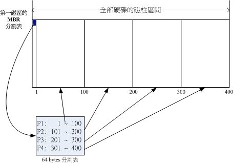

* 假設上圖中的硬碟是 /dev/sda，則四個分割槽的名稱分別為：
  1. /dev/sda1 (P1)
  2. /dev/sda2 (P2)
  3. /dev/sda3 (P3)
  4. /dev/sda4 (P4)

* 四個分割槽似乎不夠用？可以透過「擴展分割槽」（Extended Partition）來解決：

  * 一般的分割槽稱為「主分割槽」（Primary Partition），最多只能有 4 個。(例如上面的 /dev/sda1 ~ /dev/sda4)

  * 可以將其中一個 Primary Partition 改為「Extended Partition」。
  
  * Extended Partition 中能再分出多個「邏輯分割槽」（Logical Partition），這樣就能突破「4」的上限。看下圖會比較清楚：

    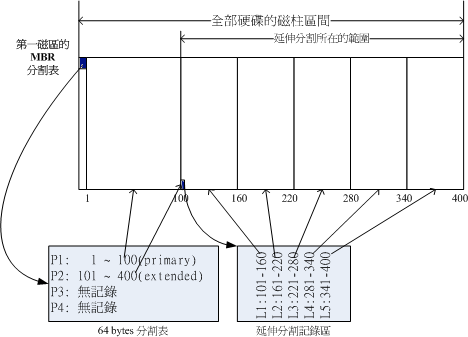

    > 圖中 L1 ~ L5 就是邏輯分割槽。

  * 在 Linux 中的命名規則中，sda1 ~ sda4 **專門給** Primary & Extended Partition 使用，sda5 之後才是 Logical Partition 。所以上圖中的分割槽名稱如下：

    1. /dev/sda1 (P1)
    2. /dev/sda2 (P2)

    ---

    3. /dev/sda5 (L1)
    4. /dev/sda6 (L2)
    5. /dev/sda7 (L3)
    6. /dev/sda8 (L4)
    7. /dev/sda9 (L5)

    > 沒有 /dev/sda3 與 /dev/sda4，因為 Primary、Extended 共兩個，其餘都是 Logical。

統整一下 MBR 的分割槽限制：

* Primary Partition 最多 4 個。

* Extended Partition 最多 1 個。

* Logical Partition 的上限取決於作業系統。

* 只有 Primary & Logical Partition 可以被格式化成檔案系統，Extended Partition 不行。


用例題來複習一下：

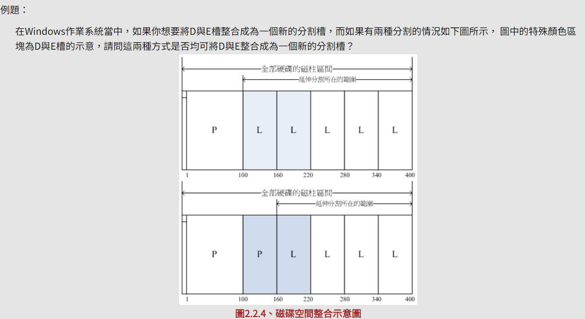


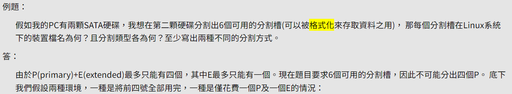

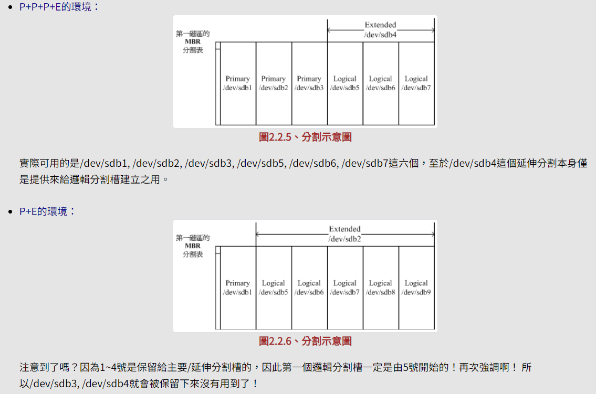

### GPT Partition Table (GUID partition table)

前面說過 MBR 算比較早的作業系統，所以有些缺陷：

* 因為分割表只有 64 bytes，導致可記錄的硬碟資訊有限，所以 2.2 T 以上的硬碟無法使用 MBR。

* MBR 僅有一個 Partition Table，被破壞後經常無法或很難救援。

* MBR 內的存放開機管理程式的區塊僅 446bytes，無法容納較多的程式碼。

GPT 就是為了解決這些問題而誕生的：

* GPT 透過使用了硬碟的「前 34 個 LBA」來記錄磁碟資訊。(LBA 預設大小為 512 bytes，整個硬碟的第一個 LBA 編號為 0)

* GPT 沒有 Primary、Extended、Logical 的概念，只有「分割槽」的概念。也就是每個分割槽都是 Primary。

* 為了避免 MBR 單一 Table 的風險，GPT 使用了硬碟「最後的 33 個 LBA」來備份「前面 LBA」紀錄的磁碟資訊。如圖：

  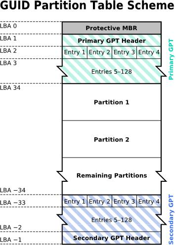
  > LBA 0 ~ 33 就是 GPT 紀錄的磁碟資訊，而 LBA -1 ~ -33 就是備份。


  * **LBA0 (MBR 相容區塊)**

    與 MBR 模式相似，這個相容區塊也分為兩個部份：
    
    1. 開機管理程式 (446 bytes)。
    
    2. 「GPT 特殊標誌」：這裡本來是 MBR 的 Table，不過 GPT 僅紀錄一個特殊標誌，用來表示此磁碟為 GPT 格式之意。(支援 GPT 的作業系統才能操作此硬碟)

  * **LBA1 (GPT 表頭紀錄)**

    這個部份紀錄了三個資訊：
    
    1. GPT Patition Table 本身的「位置」與「大小」
    
    2. GPT 備份 (LBA -1 ~ -33) 的位置
    
    3. 檢驗機制碼 (CRC32)：作業系統可以根據這個檢驗碼來判斷 GPT 是否正確。若有錯誤，還可以透過這個紀錄區來取得 GPT 備份來救援。

  * **LBA2-33 (Partition Table)**

    從 LBA2 區塊開始，每個 LBA 都可以紀錄 4 筆分割紀錄，所以預設共可以有 4 * 32 = 128 筆分割紀錄。
    
    因為每個 LBA 預設是 512bytes，因此每筆紀錄佔 128 bytes 的空間。相比於 MBR 每筆紀錄才 16 bytes，GPT 可記錄的磁區大大增加，因此能支援容量較大的硬碟。

    GPT Partition Table 的每條紀錄中，有 64 bits 能用來記錄分割槽的起始與結束位置，因此如果以每個 LBA = 512 bytes 來算，*理論上* GPT 的儲存上限為「2^64 * 512 bytes = 8 ZB (Zettabyte) = 2^33 TB」。

    > 2^64 代表的是「LBA 號碼的數量」，而 512 bytes 是每個 LBA 的大小。
  
### 統整：MBR vs GPT

| | MBR | GPT |
|--- | --- | --- |
| 出現先後 | 早期 | 後期 |
| 單位 | Sector | LBA |
| Partition Table 位置 | 第一個 Sector 裡的 16 byte | LBA 2 ~ LBA 33 |
| 單筆 Partition Table 紀錄大小 | 16 bytes | 128 bytes |
| 支援的容量上限 | 2.2 TB | 8 ZB (2^33 TB) |
| 有無備份 | 無 | 有，備份在硬碟最後 33 個 LBA |
| 有無 Primary/Extended/Logical 之分 | 有 | 無 |

### 掛載 (Mount)

在 Linux 中，檔案系統將資料呈現在使用者面前的方式，就是「目錄樹」。

但是目錄樹裡面放置的檔案，事實上存放在硬碟裡面，那該如何將硬碟中的資料與目錄樹關聯起來呢？

這就是談到「掛載」的概念。

所謂掛載，就是將某個「格式化後的儲存空間」與目錄樹中的某個目錄關聯起來，例如下圖中將 partition 1 「掛載」到 `/` 、partition 2 「掛載」到 `/home`：

> 一定要格式化後的硬體才能被掛載！因為沒有格式化就代表該硬體沒有檔案系統、沒有檔案系統就無法被作業系統識別。

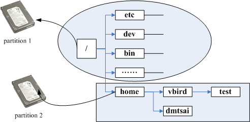

在這個例子中，`/` 目錄與 `/home` 目錄就稱為「**掛載點** (Mount Point)」，當我把資料放進 /home 時，實際上這些資料會被寫入 partition 2。

> 簡單來說，「掛載」指的是一個動作，一個把儲存空間與目錄樹連結的動作。而「掛載點」指的是一個目錄，是我們將資料寫入分割槽的「入口」。

提前規劃好掛載的方式，我們就能夠在人類看得懂的目錄樹底下操作，而不用時時考慮到底資料要存在哪裡。

### 用一條思路把「前情提要」串起來

* 硬碟是用來存資料的地方。

* 通常硬碟會被切分成多個「分割槽」，每個分割槽就是一個 Partition。

* 為了清楚分割的情況，我們需要「分割表」，而分割表則分為 MBR 與 GPT 兩種。

* 切好分割槽後，但此時硬碟單純只是硬體，無法被作業系統(Operating System)使用。

* 因此我們對硬碟進行「格式化」，讓它具備檔案系統的格式。(通常會把格式化後的儲存空間直接稱為檔案系統)

* 格式化後，我們就能將儲存空間掛載到適合的目錄，以後我們就能透過目錄樹來管理檔案了！


---
**注意**

傳統的磁碟與檔案系統之應用中，一個分割槽就是只能夠被格式化成為一個檔案系統，所以我們可以說一個 filesystem 就是一個 partition。

但是由於新技術的利用，例如我們常聽到的LVM與軟體磁碟陣列(software raid)， 這些技術可以將一個分割槽格式化為多個檔案系統(例如LVM)，也能夠將多個分割槽合成一個檔案系統(LVM, RAID)！ 所以說，目前我們在格式化時已經不再說成針對 partition 來格式化了， 通常我們可以稱呼一個可被掛載的資料為一個檔案系統，而不是一個分割槽喔！

---

## Linux 的檔案系統與 VFS

不同的檔案系統有不同的應用場景，常見的檔案系統有：

* 傳統檔案系統：ext2 / minix / MS-DOS / FAT (用 vfat 模組) / iso9660 (光碟)等等；
* 日誌式檔案系統： ext3 /ext4 / ReiserFS / Windows' NTFS / IBM's JFS / SGI's XFS / ZFS
* 網路檔案系統： NFS / SMBFS

> 有看過、知道這些檔案系統就行，知道怎麼觀察硬碟上使用的是哪種檔案系統比較重要(後面會介紹)。

這麼多檔案系統都可以同時在 Linux 上使用，只要 Kernel 支援即可。不過不同的檔案系統操作也有差異，難道使用者要清楚的知道現在在操作哪種檔案系統底下的檔案嗎？

不需要，Linux Kernel 中的 **VFS (Virtual File System)** 會幫我們處理這些事情，使用者只要操作目錄樹就好，VFS 會根據檔案系統的不同來呼叫不同的模組來處理：


### 補充：EXT 家族

EXT 家族是 Linux 支援最廣的檔案系統，其中最早的版本是 EXT2，現在已經出到 EXT4 了。

* 屬於「索引式檔案系統」。

* EXT3、EXT4 都支援「日誌檔案系統」(Journaling File System)，方便在系統寫入不一致時快速偵錯並修復。

> 關於 EX2 -> EXT4 的變化與差別，有興趣可以看[這裡](https://tw.easeus.com/partition-manager-tips/ext2-ext3-ext4-file-system-format-and-difference.html)

## 檔案系統如何運作？

首先，我們知道一個檔案除了實際內容之外，還有一些「檔案屬性」，例如檔案名稱、檔案大小、擁有者、權限等等。

儲存空間在格式化後會形成檔案系統，在 Linux 的檔案系統中，有以下三者來記錄檔案的相關資訊：

* **Block**：記錄檔案的「內容」。一個 block 只能存一個檔案的內容，當檔案太大會占用多個 block，反過來說檔案太小就會浪費 block。

* **Inode**：記錄檔案的「屬性」，例如檔案大小、擁有者、權限、atime/mtime/ctime 等等。一個檔案占用一個 inode，inode 中會記錄這個檔案的 block 號碼。

* **Superblock**：記錄這個檔案系統的資訊，包括 inode/block 的總量、使用量、省略量，以及檔案系統的格式等等。

圖示說明：

> 檔案系統先格式化出 inode 與 block 的區塊，假設某一個檔案的屬性與權限資料放置到 inode 4 號(下圖較小方格內)，而這個 inode 記錄了檔案資料的實際放置點為 2, 7, 13, 15 這四個 block 號碼，此時我們的作業系統就能夠據此來排列磁碟的讀取順序，可以一口氣將四個 block 內容讀出來！


這種資料存取方式稱為「索引式檔案系統(Indexed Allocation)」，例如 **EXT** 系列。

不過，隨身碟使用的 FAT 檔案系統因為沒有 inode 的概念，所以如果一個檔案被拆成多個 block，讀取方式如下：


上圖假設檔案的資料依序寫入 1-> 7 -> 4 -> 15 這四個 block 號碼中，但檔案系統沒有辦法一口氣就知道四個 block 的號碼，他得要一個一個的將 block 讀出後，才會知道下一個 block 在何處。

磁碟是一圈一圈讀取的，如果資料寫得太分散，可能要轉好幾圈才會讀完整份資料。此時就需要「磁碟重組」，將同一個檔案的 block 放在一起，這樣讀取效率就會提高。

### 檔案讀取的流程(重要觀念)

在前面的章節提過，目錄其實也是一個檔案，紀錄的是「檔名清單」，這要先記住。

建立一個新目錄時，索引式檔案系統會：

* 分配一個 inode 與至少一個 block 給該目錄目錄：

* 目錄的 inode：紀錄目錄的屬性與權限，以及該目錄的 block 號碼。

* 目錄的 block：紀錄該目錄下的檔案名稱與該檔案的 inode 號碼。如下圖：

  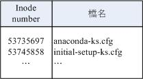

> 要記住，inode 本身不記檔名，檔名是紀錄在所屬目錄的 block 中。

建立一個新檔案時，索引式檔案系統會：

* 分配一個 inode 與能夠容納該檔案內容的 block 數量。

* 如果檔案太大時 block 的數量會很多，如果多到記不住，EXT 家族會用「間接區塊」(Indirect Block) 來記錄其餘的 block 的號碼，如下圖：

  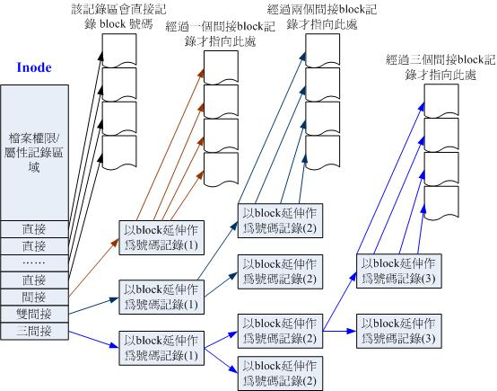

  > 間接區塊的概念是：用一個 block 記錄其他 block 的號碼，這樣就能夠突破一個 inode 只能記錄有限個 block 的限制。

OK，知道目錄與檔案的 inode 與 block 紀錄甚麼之後，來看一個讀取「/etc/passwd」的流程：

* 首先，我們列出 `/`、`/etc`、`/etc/passwd` 這三個目錄的 inode，以便觀察：

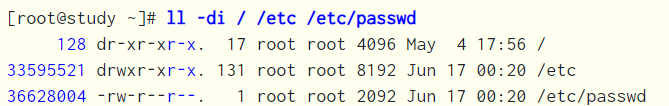

讀取順序：

> 假設以下我們用 others 的身分讀取 /etc/passwd 。

1. / 的 inode：

  透過掛載點的資訊找到 inode 號碼為 128 的根目錄 inode，且 inode 中記錄的權限讓我們
可以讀取該 block 的內容 (有 r 與 x)

2. / 的 block：

  讀取 inode 128 中的 block，找到名稱為 etc 的檔案，並找到 etc 的 inode 號碼(33595521)。

3. etc 的 inode：

  讀取 33595521 號 inode 得知我們有 r 與 x 的權限，因此可以讀取 /etc 的 block 內容。

4. etc 的 block：
  
  讀取 /etc 的 block 後，找到名稱為 passwd 的檔案，並找到 passwd 的 inode 號碼 (36628004)；

5. passwd 的 inode：
  
  讀取 36628004 號 inode 得知我們具有 r 的權限，因此可以讀取 passwd 的 block 內容。

6. passwd 的 block：
  
  最後將該 block 內容的資料讀出來。


### Inode 的觀察

在 Linux 中，我們可以透過 `ls -i` 來觀察檔案的 inode 號碼：

```bash
ls -i /etc/passwd
```

如果你發現有很多檔案的 inode 一樣，只有兩種可能：

1. 他們是連結檔：

  連結檔可以理解成「捷徑」，也就是不同的檔名指向相同的 inode 與 block，因此屬性、檔案內容都是一樣的：

  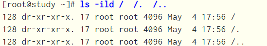

  > 解釋可以回去看[第三章](https://github.com/michaelchen1225/Linux-note/blob/master/03%20%E6%AA%94%E6%A1%88%E6%AC%8A%E9%99%90%E8%88%87%E7%9B%AE%E9%8C%84%E9%85%8D%E7%BD%AE/03.md)我們講連結數量的部分。

2. 他們屬於不同檔案系統：

  相同檔案系統的 inode 號碼是不會重複的，因此如果你發現 inode 重複，且屬性、內容都不一樣，代表他們不是連結檔，那只會是「不同檔案系統」的檔案，也表示他們分別處於不同的儲存空間中：

  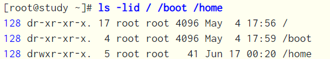

  > 這個部分我們在後面會介紹如何觀察硬碟上的檔案系統。

  ## 操作檔案系統

  以下為操作檔案系統的基本指令。

### 分析硬碟使用量：df & du

* **df**：列出檔案系統的硬碟使用量。

  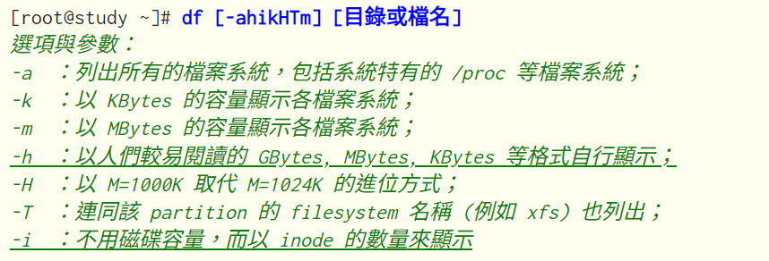

    > 常用：-a：列出所有檔案系統、-h：以人類易讀的方式顯示容量、-T：顯示檔案系統類型。

  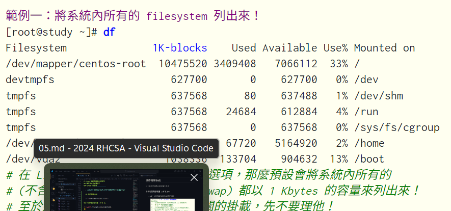


  
  輸出解釋：
  * **Filesystem**：代表該檔案系統是在哪個 partition ，所以列出裝置名稱。

  * **1k-blocks**：說明底下的數字單位是 1KB，說明裝置的總容量。

  * **Used**：使用掉的磁碟空間。

  * **Available**：剩餘的磁碟空間大小。(Used + Available = 1k-blocks)

  * **Use%**：磁碟的使用率。如果使用率高達 90% 以上時，最好需要注意一下了，免得容量不足造成系統問題。

  * **Mounted on**：掛載點。

  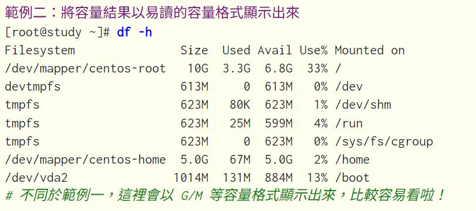
  
  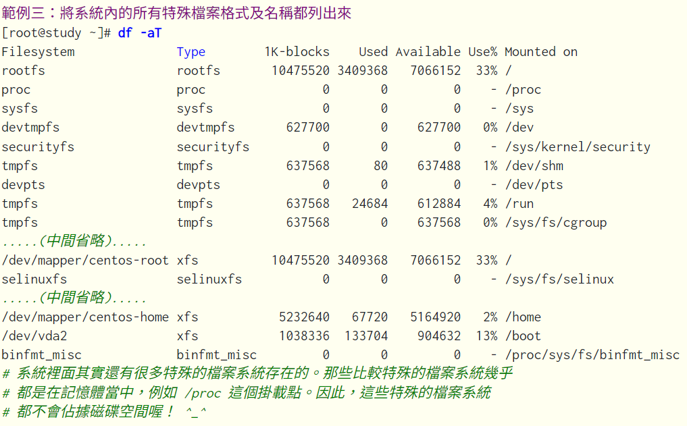

  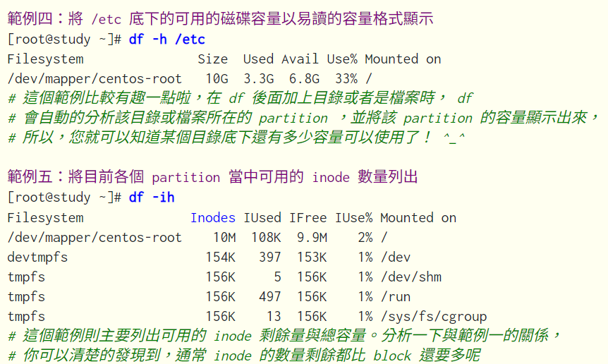

* **du**：常用在推估目錄所佔容量。

  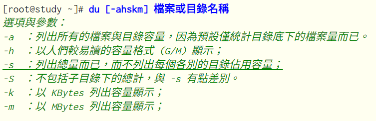

  > 常用：-a：所有檔案、目錄、-h：以人類可讀的方式顯示容量、-s：只顯示目錄的總容量。

  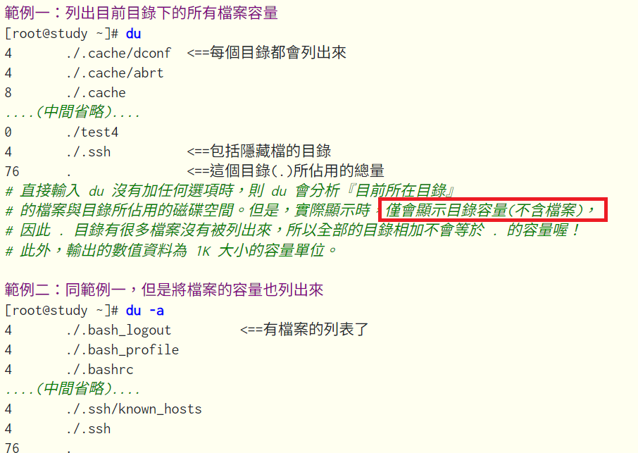
  
  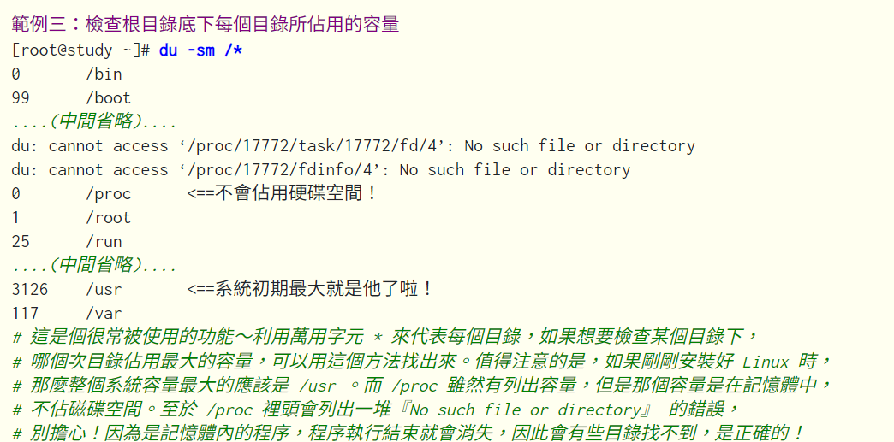


### 建立連結檔：ln

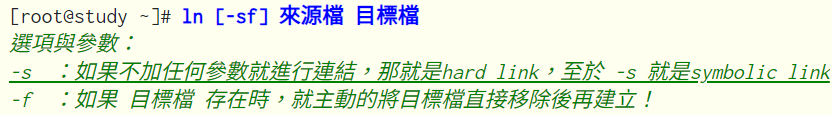

ln 建立的連結檔分為兩種：

1. **hard link**：當我們幫一個檔案建立 hard link 時，新連結檔的 inode 會與原檔案的 inode 一樣，也就是說他們是同一個檔案，只是有不同的檔名而已。底下為 /etc/crontab 建立一個 hard link 到當前目錄：

    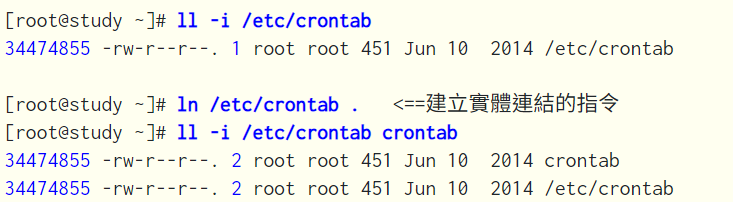

    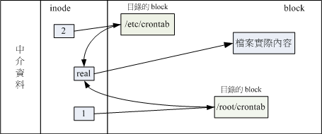
    > 圖片解釋：你可以透過 1 或 2 的目錄之 inode 指定的 block 找到兩個不同的檔名，而不管使用哪個檔名均可以指到 real 那個 inode 去讀取到最終資料。即使任何一個檔名被刪除，inode 與 block 都還存在，因此仍可以透過另一個檔名來讀取到正確的資料。


2. **symbolic link**：當我們建立 symbolic link 時，新連結檔的 inode 與原檔案的 inode 不同，代表為不同檔案，連結檔僅記錄原檔案的「路徑」。底下為 /etc/crontab 建立一個 symbolic link 到當前目錄，取名叫 crontab2


   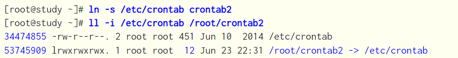
   > 為什麼上表中連結檔的大小為 12 bytes 呢？ 因為箭頭(-->)右邊的檔名『/etc/crontab』總共有 12 個英文，每個英文佔用 1 個 bytes ，所以檔案大小就是 12bytes了。

   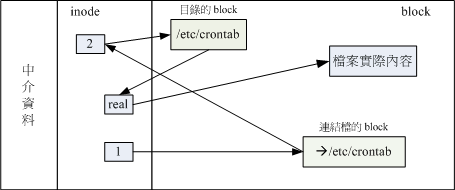
   > 圖片解釋：由 1 號目錄 inode 讀取到連結檔的內容僅有檔名，根據檔名連結到正確的目錄去取得目標檔案的 inode ，最終就能夠讀取到正確的資料了。如果目標檔案(/etc/crontab)被刪除了，那麼整個環節就會無法繼續進行下去， 所以就會發生無法透過連結檔讀取的問題了！

* hard link vs symbolic link：

  | | hard link | symbolic link |
  |--- | --- | --- |
  | 優點 | 安全：刪除檔案後另一方仍可正常存取 | 可以跨檔案系統建立連結，也可以對目錄建立連結，使用上較彈性 |
  | 缺點 | 1. 無法跨檔案系統建立連結 (因為不同檔案系統的 inode 號碼不同) | 1. 刪除原檔案後，連結檔就無法正常存取 (因為 symbolic link 只是一個「檔名路徑的指向」) |
  |      | 2. 無法對目錄建立連結 (理論上可行，但實務上會造成混淆或錯誤) | ---  |
  | 應用 | 如果只是想為檔案建立連結，hard link 是較為保險的作法 | 應用於對「目錄」建立連結，或是跨檔案系統建立連結 |
