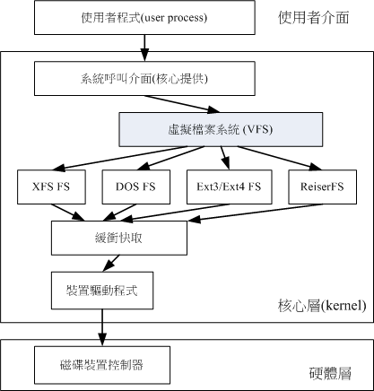
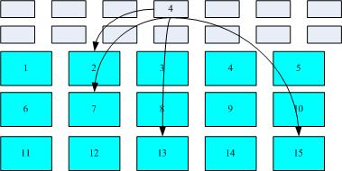

# Linux 磁碟與檔案系統管理

## 目錄

* [前情提要](#前情提要)
  * [檔案系統 vs 作業系統](#檔案系統-vs-作業系統)
  * [格式化](#格式化)
  * [Linux 中的磁碟檔名](#linux-中的磁碟檔名)
  * [磁區（Sector）](#磁區sector)
  * [硬碟分割 (Partition)](#硬碟分割-partition)
  * [MBR Partition Table](#mbr-partition-table)
  * [GPT Partition Table (GUID partition table)](#gpt-partition-table-guid-partition-table)
  * [統整：MBR vs GPT](#統整mbr-vs-gpt)
  * [掛載 (Mount)](#掛載-mount)
  * [把「前情提要」串起來](#把前情提要串起來)

## 前情提要

### 檔案系統 vs 作業系統

* **作業系統 (Operating System)**：

  OS 其實也是一組程式， 重點在「管理電腦的所有活動以及驅動系統中的所有硬體」。

  電腦沒有軟體只是一堆廢鐵，作業系統的功能就是讓CPU可以開始判斷邏輯與運算數值、 讓主記憶體可以開始載入/讀出資料與程式碼、讓硬碟可以開始被存取、讓網路卡可以開始傳輸資料、 讓所有周邊可以開始運轉等等。總之，硬體的所有動作都必須要透過這個作業系統來達成。

* **檔案系統 (File System)**：

  作業系統如果想要將資料存到硬碟，這個「存放」的動作其實 OS 本身就能搞定。

  但是為了讓人類能夠管理、存取這些「0101」，就需要「檔案系統」的幫忙了。

  檔案系統的重點是「資料該如何方便的讓**人類**儲存、存取、識別」，例如檔案名稱、路徑、格式等等。透過檔案系統，我們不需要知道資料究竟儲存在哪顆硬碟，只需要清楚了說明「檔案路徑」即可。

> 總之，沒有 Operating System 我們就無法操作(Operate)電腦、沒有 File System 我們就無法管理檔案(file)。

### 格式化

為什麼需要進行『格式化』呢？

我們知道硬碟是用來存資料的，但是硬碟本身只是單純的硬體，並無法儲存任何檔案。

為了讓作業系統儲存檔案，因此需要將硬碟進行**格式化**，讓硬碟成為作業系統能夠利用的『檔案系統格式(filesystem)』。

不同的檔案系統有不同的格式，因此格式化並不是單純的抹掉資料，而是**讓硬碟具有「某種檔案系統的格式」**，讓作業系統能夠儲存資料、讓我們能管理檔案。

* 在一個硬碟中會存在多個 Partition，每個 Partition 都可以選擇不同的檔案系統來格式化、也可以全部都選一樣的檔案系統，就看使用者的需求。

> 常見的檔案系統：NTFS、FAT32、EXT4、XFS、ZFS 等等，每種檔案系統都有自己的格式與特性。一個電腦裡可以存在多種不同的檔案系統，只要作業系統支援即可。

### Linux 中的磁碟檔名

* 硬碟就是拿來存放檔案的地方。

* 硬碟在 Linux 中也是檔案，依照 Linux Kernel 偵測到的順序為硬碟命名。

* 第一個被偵測到的硬碟為 `/dev/sda`，第二個為 `/dev/sdb`，第三個為 `/dev/sdc`，以此類推。

### 磁區（Sector）

* 磁碟的最小物理儲存單位：磁區（Sector），常見大小有早期的 512 bytes 與後續出現的 4K bytes。

* 以前通常是 512 bytes，後面為了彈性的支援不同大小的磁區，硬碟會使用「邏輯區塊位址(Logical block addressing, **LBA**)」來對應資料到底存在哪裡，而不再使用磁區來定址。

* 總之，從 Sector 與 LBA 都表示「硬碟上的儲存單位」，只是 Sector 是物理上的單位，而 LBA 是邏輯上的單位。

> LBA 要記一下，下面介紹 GPT 分割時會提到。

### 硬碟分割 (Partition)


* 一顆硬碟通常會切出多個「分割槽」，每個分割槽就是一個 Partition。(例如 Windows 的 C 槽、D 槽就是不同的 Partition) 

* 幹嘛切分 Partition？因為：

  * 效利用硬碟空間
  * 提高讀取性能 (檔案集中在某槽，存取時不需要找整顆硬碟)
  * 區隔不同用途的檔案、作業系統等等。例如「多重開機」就是透過不同 Partition 裝不同作業系統，實現一台電腦可以開不同作業系統

* 系統透過「分割表」（Partition Table）來記錄硬碟上的到底分了哪些槽。分割表有兩種格式：MBR 與 GPT。

### MBR Partition Table

* 較為早期的分割表，是 Linux 為了相容 Windows 磁碟而設計的。

* MBR 的「第一個」 Sector (512 bytes) 有兩個重要資料：
  1. **Partition Table**：記錄硬碟上的分割槽情況。(佔 64 bytes)
  2. **Master Boot Record**：開機管理程式。(佔 446 bytes)

* 每分出一個分割槽，就會在 Partition Table 中新增一筆記錄，該紀錄占用 16 bytes，主要表明該分割槽的起始與結束位置。

* 由於 MBR 的 Partition Table 只有 64 bytes，因此**最多**只能分出 4 個分割槽。

  

* 假設上圖中的硬碟是 /dev/sda，則四個分割槽的名稱分別為：
  1. /dev/sda1 (P1)
  2. /dev/sda2 (P2)
  3. /dev/sda3 (P3)
  4. /dev/sda4 (P4)

* 四個分割槽似乎不夠用？可以透過「擴展分割槽」（Extended Partition）來解決：

  * 一般的分割槽稱為「主分割槽」（Primary Partition），最多只能有 4 個。(例如上面的 /dev/sda1 ~ /dev/sda4)

  * 可以將其中一個 Primary Partition 改為「Extended Partition」。
  
  * Extended Partition 中能再分出多個「邏輯分割槽」（Logical Partition），這樣就能突破「4」的上限。看下圖會比較清楚：

    

    > 圖中 L1 ~ L5 就是邏輯分割槽。

  * 在 Linux 中的命名規則中，sda1 ~ sda4 **專門給** Primary & Extended Partition 使用，sda5 之後才是 Logical Partition 。所以上圖中的分割槽名稱如下：

    1. /dev/sda1 (P1)
    2. /dev/sda2 (P2)

    ---

    3. /dev/sda5 (L1)
    4. /dev/sda6 (L2)
    5. /dev/sda7 (L3)
    6. /dev/sda8 (L4)
    7. /dev/sda9 (L5)

    > 沒有 /dev/sda3 與 /dev/sda4，因為 Primary、Extended 共兩個，其餘都是 Logical。

統整一下 MBR 的分割槽限制：

* Primary Partition 最多 4 個。

* Extended Partition 最多 1 個。

* Logical Partition 的上限取決於作業系統。

* 只有 Primary & Logical Partition 可以被格式化成檔案系統，Extended Partition 不行。


用例題來複習一下：


### GPT Partition Table (GUID partition table)

前面說過 MBR 算比較早的作業系統，所以有些缺陷：

* 因為分割表只有 64 bytes，導致可記錄的硬碟資訊有限，所以 2.2 T 以上的硬碟無法使用 MBR。

* MBR 僅有一個 Partition Table，被破壞後經常無法或很難救援。

* MBR 內的存放開機管理程式的區塊僅 446bytes，無法容納較多的程式碼。

GPT 就是為了解決這些問題而誕生的：

* GPT 使用 「Logical Block Addressing (LBA)」來定義磁區，第一個 LBA 編號為 0、第二個 LBA 編號為 1，以此類推。

* LBA 預設大小為 512 bytes。

* GPT 透過使用了硬碟的「前 34 個 LBA」來記錄磁碟資訊。

* GPT 沒有 Primary、Extended、Logical 的概念，只有「分割槽」的概念。也就是每個分割槽都是 Primary。

* 為了避免 MBR 單一 Table 的風險，GPT 使用了硬碟「最後的 33 個 LBA」來備份「前面 LBA」紀錄的磁碟資訊。如圖：

  
  > LBA 0 ~ 33 就是 GPT 紀錄的磁碟資訊，而 LBA -1 ~ -33 就是備份。


  * **LBA0 (MBR 相容區塊)**

    與 MBR 模式相似，這個相容區塊也分為兩個部份：
    
    1. 開機管理程式 (446 bytes)。
    
    2. 「GPT 特殊標誌」：這裡本來是 MBR 的 Table，不過 GPT 僅紀錄一個特殊標誌，用來表示此磁碟為 GPT 格式之意。(支援 GPT 的作業系統才能操作此硬碟)

  * **LBA1 (GPT 表頭紀錄)**

    這個部份紀錄了三個資訊：
    
    1. GPT Patition Table 本身的「位置」與「大小」
    
    2. GPT 備份 (LBA -1 ~ -33) 的位置
    
    3. 檢驗機制碼 (CRC32)：作業系統可以根據這個檢驗碼來判斷 GPT 是否正確。若有錯誤，還可以透過這個紀錄區來取得 GPT 備份來救援。

  * **LBA2-33 (Partition Table)**

    從 LBA2 區塊開始，每個 LBA 都可以紀錄 4 筆分割紀錄，所以預設共可以有 4 * 32 = 128 筆分割紀錄。
    
    由於每個 LBA 預設是 512bytes，且可以記錄 4 筆分割資訊，因此每筆紀錄佔 128 bytes 的空間。相比於 MBR 每筆紀錄才 16 bytes，GPT 可記錄的磁區大大增加，因此能支援容量較大的硬碟。

    GPT Partition Table 的每筆紀錄中，有 64 bits 能用來記錄分割槽的起始與結束位置，因此如果以每個 LBA = 512 bytes 來算，*理論上* GPT 的儲存上限為「2^64 * 512 bytes = 8 ZB (Zettabyte) = 2^33 TB」。

    > 2^64 代表的是「LBA 號碼的數量」，而 512 bytes 是每個 LBA 的大小。
  
### 統整：MBR vs GPT

| | MBR | GPT |
|--- | --- | --- |
| 出現先後 | 早期 | 後期 |
| 單位 | Sector | LBA |
| Partition Table 位置 | 第一個 Sector 裡的 16 byte | LBA 2 ~ LBA 33 |
| 單筆 Partition Table 紀錄大小 | 16 bytes | 128 bytes |
| 支援的容量上限 | 2.2 TB | 8 ZB (2^33 TB) |
| 有無備份 | 無 | 有，備份在硬碟最後 33 個 LBA |
| 有無 Primary/Extended/Logical 之分 | 有 | 無 |

### 掛載 (Mount)

在 Linux 中，檔案系統將資料呈現在使用者面前的方式，就是「目錄樹」。

但是目錄樹裡面放置的檔案，事實上存放在硬碟裡面，那該如何將硬碟中的資料與目錄樹關聯起來呢？

這就是談到「掛載」的概念。

所謂掛載，就是將某個「格式化後的儲存空間」與目錄樹中的某個目錄關聯起來，例如下圖中將 partition 1 「掛載」到 `/` 、partition 2 「掛載」到 `/home`：

> 一定要格式化後的硬體才能被掛載！因為沒有格式化就代表該硬體沒有檔案系統、沒有檔案系統就無法被作業系統識別。


在這個例子中，`/` 目錄與 `/home` 目錄就稱為「**掛載點** (Mount Point)」，當我把資料放進 /home 時，實際上這些資料會被寫入 partition 2。

> 簡單來說，「掛載」指的是一個動作，一個把儲存空間與目錄樹連結的動作。而「掛載點」指的是一個目錄，是我們將資料寫入分割槽的「入口」。

提前規劃好掛載的方式，我們就能夠在人類看得懂的目錄樹底下操作，而不用時時考慮到底資料要存在哪裡。

### 把「前情提要」串起來

* 硬碟是用來存資料的地方。

* 通常硬碟會被切分成多個「分割槽」，每個分割槽就是一個 Partition。

* 為了清楚分割的情況，我們需要「分割表」，而分割表則分為 MBR 與 GPT 兩種。

* 切好分割槽後，但此時硬碟單純只是硬體，無法被作業系統(Operating System)使用。

* 因此我們對硬碟進行「格式化」，讓它具備檔案系統的格式。(通常會把格式化後的儲存空間直接稱為檔案系統)

* 格式化後，我們就能將儲存空間「掛載」到適合的目錄，以後我們就能透過目錄樹來管理檔案了！


---

**注意**

傳統的磁碟與檔案系統之應用中，一個分割槽就是只能夠被格式化成為一個檔案系統，所以我們可以說一個 filesystem 就是一個 partition。

但是由於新技術的利用，例如我們常聽到的LVM與軟體磁碟陣列(software raid)， 這些技術可以將一個分割槽格式化為多個檔案系統(例如LVM)，也能夠將多個分割槽合成一個檔案系統(LVM, RAID)！ 所以說，目前我們在格式化時已經不再說成針對 partition 來格式化了， 通常我們可以稱呼一個可被掛載的資料為一個檔案系統，而不是一個分割槽喔！

---

## Linux 的檔案系統與 VFS

不同的檔案系統有不同的應用場景，常見的檔案系統有：

* 傳統檔案系統：ext2 / minix / MS-DOS / FAT (用 vfat 模組) / iso9660 (光碟)等等。

* 日誌式檔案系統： ext3 /ext4 / ReiserFS / Windows' NTFS / IBM's JFS / SGI's XFS / ZFS。

* 網路檔案系統： NFS / SMBFS

> 有看過、知道這些檔案系統就行，知道怎麼觀察硬碟上使用的是哪種檔案系統比較重要(後面會介紹)。

這麼多檔案系統都可以同時在 Linux 上使用，只要 Kernel 支援即可。不過不同的檔案系統操作也有差異，難道使用者要清楚的知道現在在操作哪種檔案系統底下的檔案嗎？

不需要，Linux Kernel 中的 **VFS (Virtual File System)** 會幫我們處理這些事情，使用者只要操作目錄樹就好，VFS 會根據檔案系統的不同來呼叫不同的模組來處理：




### 補充：EXT 家族

EXT 家族是 Linux 支援最廣的檔案系統，其中最早的版本是 EXT2，現在已經出到 EXT4 了。

* 屬於「索引式檔案系統」。

* EXT3、EXT4 都支援「日誌檔案系統」(Journaling File System)，方便在系統寫入不一致時快速偵錯並修復。

> 關於 EX2 -> EXT4 的變化與差別，有興趣可以看[這裡](https://tw.easeus.com/partition-manager-tips/ext2-ext3-ext4-file-system-format-and-difference.html)

## 檔案系統如何運作？

首先，我們知道一個檔案除了實際內容之外，還有一些「檔案屬性」，例如檔案名稱、檔案大小、擁有者、權限等等。

儲存空間在格式化後會形成檔案系統，在 Linux 的檔案系統中，有以下三者來記錄檔案的相關資訊：

* **Block**：記錄檔案的「內容」。一個 block 只能存一個檔案的內容，當檔案太大會占用多個 block，反過來說檔案太小就會浪費 block。

* **Inode**：記錄檔案的「屬性」，例如檔案大小、擁有者、權限、atime/mtime/ctime 等等。一個檔案占用一個 inode，inode 中會記錄這個檔案的 block 號碼。

* **Superblock**：記錄這個檔案系統的資訊，包括 inode/block 的總量、使用量、省略量，以及檔案系統的格式等等。

圖示說明：

> 檔案系統先格式化出 inode 與 block 的區塊，假設某一個檔案的屬性與權限資料放置到 inode 4 號(下圖較小方格內)，而這個 inode 記錄了檔案資料的實際放置點為 2, 7, 13, 15 這四個 block 號碼，此時我們的作業系統就能夠據此來排列磁碟的讀取順序，可以一口氣將四個 block 內容讀出來！



這種資料存取方式稱為「索引式檔案系統(Indexed Allocation)」，例如 **EXT** 系列。

不過，隨身碟使用的 FAT 檔案系統因為沒有 inode 的概念，所以如果一個檔案被拆成多個 block，讀取方式如下：


上圖假設檔案的資料依序寫入 1-> 7 -> 4 -> 15 這四個 block 號碼中，但檔案系統沒有辦法一口氣就知道四個 block 的號碼，他得要一個一個的將 block 讀出後，才會知道下一個 block 在何處。

磁碟是一圈一圈讀取的，如果資料寫得太分散，可能要轉好幾圈才會讀完整份資料。此時就需要「磁碟重組」，將同一個檔案的 block 放在一起，這樣讀取效率就會提高。

### 檔案讀取的流程(重要觀念)

在前面的章節提過，目錄其實也是一個檔案，紀錄的是「檔名清單」，這要先記住。

建立一個新目錄時，索引式檔案系統會：

* 分配一個 inode 與至少一個 block 給該目錄目錄：

* 目錄的 inode：紀錄目錄的屬性與權限，以及該目錄的 block 號碼。

* 目錄的 block：紀錄該目錄下的檔案名稱與該檔案的 inode 號碼。下圖為一個目錄的 block：

  

> 要記住，**inode 本身不記檔名**，檔名是紀錄在所屬目錄的 block 中。

建立一個新檔案時，索引式檔案系統會：

* 分配一個 inode 與能夠容納該檔案內容的 block 數量。

* 如果檔案太大時 block 的數量會很多，如果多到記不住，EXT 家族會用「間接區塊」(Indirect Block) 來記錄其餘的 block 的號碼，如下圖：

  

  > 間接區塊的概念是：用一個 block 記錄其他 block 的號碼，這樣就能夠突破一個 inode 只能記錄有限個 block 的限制。

OK，知道目錄與檔案的 inode 與 block 紀錄甚麼之後，來看一個讀取「/etc/passwd」的流程：

首先，我們列出 `/`、`/etc`、`/etc/passwd` 這三個目錄的 inode，以便觀察：

  

讀取順序：

> 假設以下我們用 others 的身分讀取 /etc/passwd 。

1. / 的 inode：

  透過掛載點的資訊找到 inode 號碼為 128 的根目錄 inode，且 inode 中記錄的權限讓我們
可以讀取該 block 的內容 (有 r 與 x)

2. / 的 block：

  讀取 inode 128 中的 block，找到名稱為 etc 的檔案，並找到 etc 的 inode 號碼(33595521)。

3. etc 的 inode：

  讀取 33595521 號 inode 得知我們有 r 與 x 的權限，因此可以讀取 /etc 的 block 內容。

4. etc 的 block：
  
  讀取 /etc 的 block 後，找到名稱為 passwd 的檔案，並找到 passwd 的 inode 號碼 (36628004)；

5. passwd 的 inode：
  
  讀取 36628004 號 inode 得知我們具有 r 的權限，因此可以讀取 passwd 的 block 內容。

6. passwd 的 block：
  
  最後將該 block 內容的資料讀出來。


### Inode 的觀察

在 Linux 中，我們可以透過 `ls -i` 來觀察檔案的 inode 號碼：

```bash
ls -i /etc/passwd
```

如果你發現有很多檔案的 inode 一樣，只有兩種可能：

1. 他們是連結檔：

  連結檔可以理解成「捷徑」，也就是不同的檔名指向相同的 inode 與 block，因此屬性、檔案內容都是一樣的：

  

  > 解釋可以回去看[第三章](https://github.com/michaelchen1225/Linux-note/blob/master/03%20%E6%AA%94%E6%A1%88%E6%AC%8A%E9%99%90%E8%88%87%E7%9B%AE%E9%8C%84%E9%85%8D%E7%BD%AE/03.md)我們講連結數量的部分。

2. 他們屬於不同檔案系統：

  相同檔案系統的 inode 號碼是不會重複的，因此如果你發現 inode 重複，且屬性、內容都不一樣，代表他們不是連結檔，那只會是「不同檔案系統」的檔案，也表示他們分別處於不同的儲存空間中：

  

  > 這個部分我們在後面會介紹如何觀察硬碟上的檔案系統。

## 操作檔案系統

  以下為操作檔案系統的基本指令。

### 列出檔案系統的硬碟使用量：df

**語法**：

```bash
df [-ahikHTm] [目錄或檔名]
```

| Option | 說明 |
| --- | --- |
| -a | 列出所有的檔案系統，包括系統特有的 /proc 等檔案系統 |
| -k | 以 KBytes 的容量顯示各檔案系統 |
| -m | 以 MBytes 的容量顯示各檔案系統 |
| -h | 以人們較易閱讀的 GBytes, MBytes, KBytes 等格式自行顯示 |
| -H | 以 M=1000K 取代 M=1024K 的進位方式 |
| -T | 連同該 partition 的 filesystem 名稱 (例如 xfs) 也列出 |
| -i | 不用磁碟容量，而以 inode 的數量來顯示 |

常用：-h、-T

> **範例**：將系統內所有的 filesystem 列出來

```bash
df
```
```text
Filesystem              1K-blocks    Used Available Use% Mounted on
/dev/mapper/centos-root  10475520 3409408   7066112  33% /
devtmpfs                   627700       0    627700   0% /dev
tmpfs                      637568      80    637488   1% /dev/shm
tmpfs                      637568   24684    612884   4% /run
tmpfs                      637568       0    637568   0% /sys/fs/cgroup
/dev/mapper/centos-home   5232640   67720   5164920   2% /home
/dev/vda2                 1038336  133704    904632  13% /boot
```
  
  輸出解釋：
  * **Filesystem**：代表該檔案系統是在哪個 partition ，所以列出裝置名稱。

  * **1k-blocks**：說明底下的數字單位是 1KB，說明裝置的總容量。

  * **Used**：使用掉的磁碟空間。

  * **Available**：剩餘的磁碟空間大小。(Used + Available = 1k-blocks)

  * **Use%**：磁碟的使用率。如果使用率高達 90% 以上時，最好需要注意一下了，免得容量不足造成系統問題。

  * **Mounted on**：掛載點。

> **範例**：將容量結果以易讀的容量格式顯示出來

```bash
df -h
```
```text
df -h
Filesystem               Size  Used Avail Use% Mounted on
/dev/mapper/centos-root   10G  3.3G  6.8G  33% /
devtmpfs                 613M     0  613M   0% /dev
tmpfs                    623M   80K  623M   1% /dev/shm
tmpfs                    623M   25M  599M   4% /run
tmpfs                    623M     0  623M   0% /sys/fs/cgroup
/dev/mapper/centos-home  5.0G   67M  5.0G   2% /home
/dev/vda2               1014M  131M  884M  13% /boot
```

> **範例**：將系統內的所有特殊檔案格式及名稱都列出來

```bash
df -aT
```
```text
df -aT
Filesystem              Type        1K-blocks    Used Available Use% Mounted on
rootfs                  rootfs       10475520 3409368   7066152  33% /
proc                    proc                0       0         0    - /proc
sysfs                   sysfs               0       0         0    - /sys
devtmpfs                devtmpfs       627700       0    627700   0% /dev
securityfs              securityfs          0       0         0    - /sys/kernel/security
tmpfs                   tmpfs          637568      80    637488   1% /dev/shm
devpts                  devpts              0       0         0    - /dev/pts
tmpfs                   tmpfs          637568   24684    612884   4% /run
tmpfs                   tmpfs          637568       0    637568   0% /sys/fs/cgroup
.....(中間省略).....
/dev/mapper/centos-root xfs          10475520 3409368   7066152  33% /
selinuxfs               selinuxfs           0       0         0    - /sys/fs/selinux
.....(中間省略).....
/dev/mapper/centos-home xfs           5232640   67720   5164920   2% /home
/dev/vda2               xfs           1038336  133704    904632  13% /boot
binfmt_misc             binfmt_misc         0       0         0    - /proc/sys/fs/binfmt_misc
```

系統還有很多特殊的檔案系統存在。特殊的檔案系統幾乎都是在記憶體當中，例如 /proc 這個掛載點。因此，這些特殊的檔案系統都不會佔據磁碟空間。

> **範例**：將 /etc 底下的可用的磁碟容量以易讀的容量格式顯示

```bash
df -h /etc
```
```text
Filesystem               Size  Used Avail Use% Mounted on
/dev/mapper/centos-root   10G  3.3G  6.8G  33% /
```

在 df 後面加上目錄或者是檔案時， df 會自動的分析該目錄或檔案所在的 partition ，並將該 partition 的容量顯示出來，所以就可以知道某個目錄底下還有多少容量可以使用了！

> **範例**：將目前各個 partition 當中可用的 inode 數量列出

```bash
df -ih
```
```text
Filesystem              Inodes IUsed IFree IUse% Mounted on
/dev/mapper/centos-root    10M  108K  9.9M    2% /
devtmpfs                  154K   397  153K    1% /dev
tmpfs                     156K     5  156K    1% /dev/shm
tmpfs                     156K   497  156K    1% /run
tmpfs                     156K    13  156K    1% /sys/fs/cgroup
```
這個範例則主要列出可用的 inode 剩餘量與總容量。分析一下與範例一的關係，可以清楚的發現到，通常 inode 的數量剩餘都比 block 還要多呢

### 推估目錄所佔的容量：du

**語法**：

```bash
du [-ahskm] [檔案或目錄名稱]
```

| Option | 說明 |
| --- | --- |
| -a | 列出所有的檔案與目錄容量，因為預設僅統計目錄底下的檔案量而已 |
| -h | 以人們較易讀的容量格式 (G/M) 顯示 |
| -s | 列出加總後的容量 |
| -S | 不包括子目錄下的總計，與 -s 有點差別 |
| -k | 以 KBytes 列出容量顯示 |
| -m | 以 MBytes 列出容量顯示 |
| -x | 忽略不同檔案系統的檔案與目錄，僅列出同一檔案系統的容量 |
| --max-depth=N | 僅列出 N 層的目錄容量，N=0 的效果等同於 -s |

常用：-a、-h、-s

> **範例**：列出目前目錄下的所有檔案容量

```bash
du
```
```text
4       ./.cache/dconf  <==每個目錄都會列出來
4       ./.cache/abrt
8       ./.cache
....(中間省略)....
0       ./test4
4       ./.ssh          <==包括隱藏檔的目錄
76      .               <==這個目錄(.)所佔用的總量
```

直接輸入 du 沒有加任何選項時，則 du 會分析「目前所在目錄」的檔案與目錄所佔用的磁碟空間。但是，實際僅會顯示目錄容量(不含檔案)，因此 . 目錄有很多檔案沒有被列出來，所以全部的目錄相加不會等於 . 的容量喔！

(此外，輸出的數值資料為 1K 大小的容量單位)

> **範例**：同上，但是將檔案的容量也列出來

```bash
du -a
```
```text
4       ./.bash_logout         <==有檔案的列表了
4       ./.bash_profile
4       ./.bashrc
....(中間省略)....
4       ./.ssh/known_hosts
4       ./.ssh
76      .
```


> **範例**：檢查根目錄底下每個目錄所佔用的容量

```bash
du -sm /*
```
```text
0       /bin
99      /boot
....(中間省略)....
du: cannot access ‘/proc/17772/task/17772/fd/4’: No such file or directory
du: cannot access ‘/proc/17772/fdinfo/4’: No such file or directory
0       /proc      <==不會佔用硬碟空間！
1       /root
25      /run
....(中間省略)....
3126    /usr       <==系統初期最大就是他了啦！
117     /var
```


這是個很常被使用的功能，利用萬用字元 * 來代表每個目錄，如果想要檢查某個目錄下，哪個次目錄佔用最大的容量，可以用這個方法找出來。

值得注意的是，如果剛剛安裝好 Linux 時，那麼整個系統容量最大的應該是 /usr 。

而 /proc 雖然有列出容量，但是那個容量是在記憶體中，不佔磁碟空間。至於 /proc 裡頭會列出一堆『No such file or directory』 的錯誤，別擔心！因為是記憶體內的程序，程序執行結束就會消失，因此會有些目錄找不到，是正確的！


> **範例**：檢查根目錄底下每個目錄所佔用的容量 (方法二)

```bash
du -h --max-depth=1 /
```

### 顯示系統上的磁碟列表：lsblk 

***語法**：

```bash
 lsblk [-dfimpt] [device]
```

| Option | 說明 |
| --- | --- |
| -d | 僅列出磁碟本身，並不會列出該磁碟的分割資料 |
| -f | 同時列出該磁碟內的檔案系統名稱 |
| -i | 使用 ASCII 的線段輸出，不要使用複雜的編碼 (再某些環境下很有用) |
| -m | 同時輸出該裝置在 /dev 底下的權限資料 (rwx 的資料) |
| -p | 列出該裝置的完整檔名！而不是僅列出最後的名字而已。 |
| -t | 列出該磁碟裝置的詳細資料，包括磁碟佇列機制、預讀寫的資料量大小等 |


> **範例**：列出本系統下的所有磁碟與磁碟內的分割資訊

```bash
lsblk
```
```text
NAME            MAJ:MIN RM  SIZE RO TYPE MOUNTPOINT
sr0              11:0    1 1024M  0 rom
vda             252:0    0   40G  0 disk             # 一整顆磁碟
|-vda1          252:1    0    2M  0 part
|-vda2          252:2    0    1G  0 part /boot
`-vda3          252:3    0   30G  0 part
  |-centos-root 253:0    0   10G  0 lvm  /           # 在 vda3 內的其他檔案系統
  |-centos-swap 253:1    0    1G  0 lvm  [SWAP]
  `-centos-home 253:2    0    5G  0 lvm  /home
```

從上面的輸出可以看到，目前的系統主要有個 sr0 以及一個 vda 的裝置，而 vda 的裝置底下又有三個分割， 其中 vda3 甚至還有因為 LVM (後續章節會介紹) 產生的檔案系統：

* **NAME**：裝置的檔名(省略 /dev 等前導目錄)
* **MAJ:MIN**：kernal 透過 主要(MAJ)：次要(MIN)裝置代碼來識別裝置
* **RM**：是否為可卸載裝置 (removable device)，如光碟、USB 磁碟等等會顯示 1
* **SIZE**：容量
* **RO**：是否為唯讀裝置的意思，如果是 1 則表示唯讀裝置
* **TYPE**：是磁碟 (disk)、分割槽 (partition) 還是唯讀記憶體 (rom) 等輸出
MOUTPOINT：就是前一章談到的掛載點！

> **範例**：僅列出 /dev/vda 裝置內的所有資料的完整檔名


```bash
lsblk -ip /dev/vda
```
```text
NAME                        MAJ:MIN RM  SIZE RO TYPE MOUNTPOINT
/dev/vda                    252:0    0   40G  0 disk
|-/dev/vda1                 252:1    0    2M  0 part
|-/dev/vda2                 252:2    0    1G  0 part /boot
`-/dev/vda3                 252:3    0   30G  0 part
  |-/dev/mapper/centos-root 253:0    0   10G  0 lvm  /
  |-/dev/mapper/centos-swap 253:1    0    1G  0 lvm  [SWAP]
  `-/dev/mapper/centos-home 253:2    0    5G  0 lvm  /home        # 完整的檔名，由 / 開始寫
```

> 使用 LVM 管理的裝置會由 `/dev/mapper` 開頭。

### 列出裝置的 UUID、檔案系統格式：blkid

UUID 是全域單一識別碼 (universally unique identifier)，Linux 會將系統內所有的裝置都給予一個獨一無二的識別碼，作為掛載或者是使用這個裝置/檔案系統之用了。

```bash
blkid
```
```text
/dev/vda2: UUID="94ac5f77-cb8a-495e-a65b-2ef7442b837c" TYPE="xfs" 
/dev/vda3: UUID="WStYq1-P93d-oShM-JNe3-KeDl-bBf6-RSmfae" TYPE="LVM2_member"
/dev/sda1: UUID="35BC-6D6B" TYPE="vfat"
/dev/mapper/centos-root: UUID="299bdc5b-de6d-486a-a0d2-375402aaab27" TYPE="xfs"
/dev/mapper/centos-swap: UUID="905dc471-6c10-4108-b376-a802edbd862d" TYPE="swap"
/dev/mapper/centos-home: UUID="29979bf1-4a28-48e0-be4a-66329bf727d9" TYPE="xfs"
```

### (MBR or GPT ?)列出裝置的分割表類型：parted

***語法**：

```bash
parted <裝置名稱> print
```

> **範例**：列出 /dev/vda 的分割表類型

```bash
 parted /dev/vda print
```
```text
Model: Virtio Block Device (virtblk)        # 磁碟的模組名稱(廠商)
Disk /dev/vda: 42.9GB                       # 磁碟的總容量
Sector size (logical/physical): 512B/512B   # 磁碟的每個邏輯/物理磁區容量
Partition Table: gpt                        # 分割表的格式 (MBR/GPT)
Disk Flags: pmbr_boot

Number  Start   End     Size    File system  Name  Flags      # 底下才是分割資料
 1      1049kB  3146kB  2097kB                     bios_grub
 2      3146kB  1077MB  1074MB  xfs
 3      1077MB  33.3GB  32.2GB                     lvm
```

為什麼需要知道分割表的格式呢？因為之後要進行磁碟的分割時，基於不同的分割表格式，會有不同的分割指令。

* MBR：使用 `fdisk` 指令來進行分割
* GPT：使用 `gdisk` 指令來進行分割

事實上，`parted` 指令也可以用來進行磁碟的分割，且支援 MBR 與 GPT 兩種格式的磁碟分割，這後面會介紹。

### 建立連結檔：ln

**語法**

```bash
ln [-sf] 來源檔 連結檔
```

| Option | 說明 |
| --- | --- |
| -s | 建立 symbolic link，不加 option 預設為 hard link |
| -f | 如果目標檔存在時，則強制刪除後再建立連結檔 |

ln 建立的連結檔分為兩種：

1. **hard link**：當我們幫一個檔案建立 hard link 時，新連結檔的 inode 會與原檔案的 inode 一樣，也就是說他們是同一個檔案，只是有不同的檔名而已。底下為 /etc/crontab 建立一個 hard link 到當前目錄：

    ```bash
    ll -i /etc/crontab
    ```
    ```text
    34474855 -rw-r--r--. 1 root root 451 Jun 10  2014 /etc/crontab
    ```
    ```bash
    # 建立實體連結
    ln /etc/crontab . 
    ```
    ```bash
    ll -i /etc/crontab crontab
    ```
    ```text
    34474855 -rw-r--r--. 2 root root 451 Jun 10  2014 crontab
    34474855 -rw-r--r--. 2 root root 451 Jun 10  2014 /etc/crontab
    ```

    可以發現兩個檔名都連結到 34474855 這個 inode 號碼，所以檔案的權限/屬性完全一樣。
    
    因為這兩個「檔名」其實都是同一個「檔案」，而且你也會發現第二個欄位由原本的 1 變成 2 了，意義為：「有多少個檔名連結到這個 inode 號碼」。 如果將讀取到正確資料的方式畫成示意圖，就類似如下畫面：


    

    > 圖片解釋：你可以透過 1 或 2 的目錄 inode 找到 block，透過 block 找到兩個不同的檔名，而不管使用哪個檔名均可以指到 real 那個 inode 去讀取到最終資料。即使任何一個檔名被刪除，inode 與 block 都還存在，因此仍可以透過另一個檔名來讀取到正確的資料。

    基於多個檔名指向同個 inode 號碼的特性，我們可以知道：**Hard link 不能跨 filesystem**，因為不同的 filesystem 會有不同的 inode 號碼。

    另一個 hard link 的特性是：**不建議對目錄建立連結**，因為這樣會造成混淆或錯誤，尤其是拿子目錄來建立上層目錄的 hard link 時，例如：

    ```bash
    mkdir /tmp/a/sub-a
    ln /tmp/a/ /tmp/a/sub-a/link-a
    ```

    照理來說，hard link 代表兩者僅是「檔名不同」，實際上還是相同檔案，因此 link-a 其實等於上上層的 a 目錄，所以他們底下都會有 sub-a。但 sub-a 又是 link-a 的上層目錄，這就可能會造成「無限循環」：

    ```text
    /tmp/a/sub-a/link-a/sub-a/link-a/sub-a/link-a/....
    ```

    > 爺爺(a) -> 爸爸(sub-a) -> 孫子(link-a)，孫子等於爺爺這種事就很荒誕。

    

2. **symbolic link**：當我們建立 symbolic link 時，新連結檔的 inode 與原檔案的 inode 不同，代表為「不同檔案」，連結檔僅記錄原檔案的「路徑」。

    底下為 /etc/crontab 建立一個 symbolic link 到當前目錄，取名叫 crontab2

    ```bash
    ln -s /etc/crontab crontab2
    ll -i /etc/crontab /root/crontab2
    ```

    ```text
    34474855 -rw-r--r--. 2 root root 451 Jun 10  2014 /etc/crontab
    53745909 lrwxrwxrwx. 1 root root  12 Jun 23 22:31 /root/crontab2 -> /etc/crontab
    ```
   > 為什麼上表中連結檔的大小為 12 bytes 呢？ 因為箭頭(-->)右邊的檔名『/etc/crontab』總共有 12 個英文，每個英文佔用 1 個 bytes ，所以檔案大小就是 12bytes了。

   

   > 圖片解釋：由 1 號目錄 inode 讀取到連結檔的內容，該內容僅有來源檔名，根據檔名連結到正確的目錄去取得目標檔案的 inode ，最終就能夠讀取到正確的資料了。
   
   > 如果目標檔案(/etc/crontab)被刪除了，那麼整個環節就會無法繼續進行下去， 所以就會發生無法透過連結檔讀取的問題了！

   因為 symbolic link 實際上會新增出自己的 inode 與 block，且僅記錄來源檔案的路徑，因此 symbolic link 可以跨 filesystem 來建立連結，且也可以對目錄建立連結。


* hard link vs symbolic link：

  | | hard link | symbolic link |
  |--- | --- | --- |
  | 優點 | 安全：刪除檔案後另一方仍可正常存取 | 可以跨檔案系統建立連結，也可以對目錄建立連結，使用上較彈性 |
  | 缺點 | 1. 無法跨檔案系統建立連結 (因為不同檔案系統的 inode 號碼不同) | 1. 刪除原檔案後，連結檔就無法正常存取 (因為 symbolic link 只是一個「檔名路徑的指向」) |
  |      | 2. 無法對目錄建立連結 (理論上可行，但實務上會造成混淆或錯誤) | ---  |
  | 應用 | 如果只是想為檔案建立連結，hard link 是較為保險的作法 | 應用於對「目錄」建立連結，或是跨檔案系統建立連結 |


### 指令應用時機統整
https://www.cnblogs.com/yongquan/p/17440891.html
